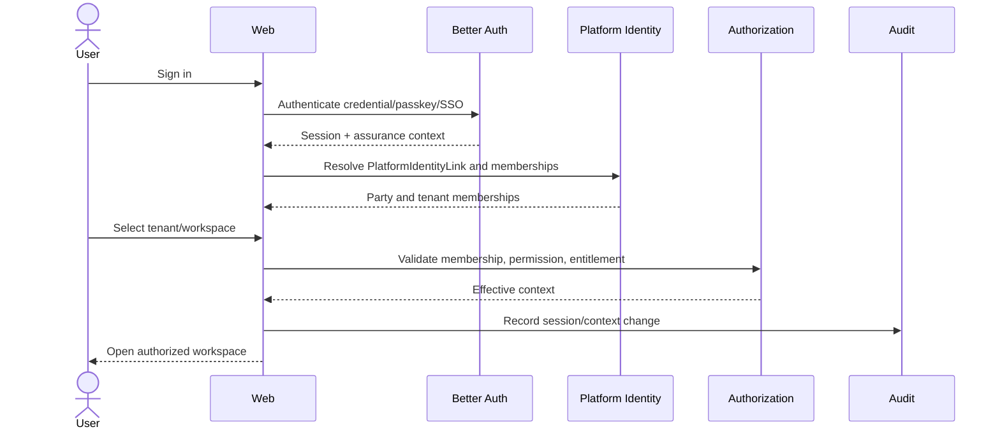
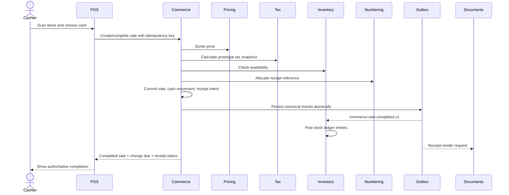
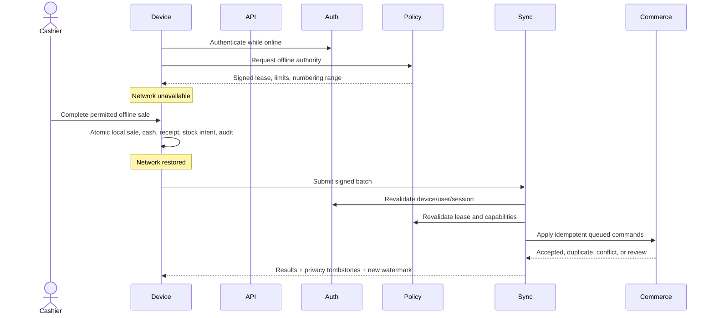
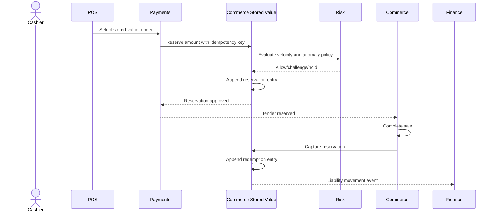
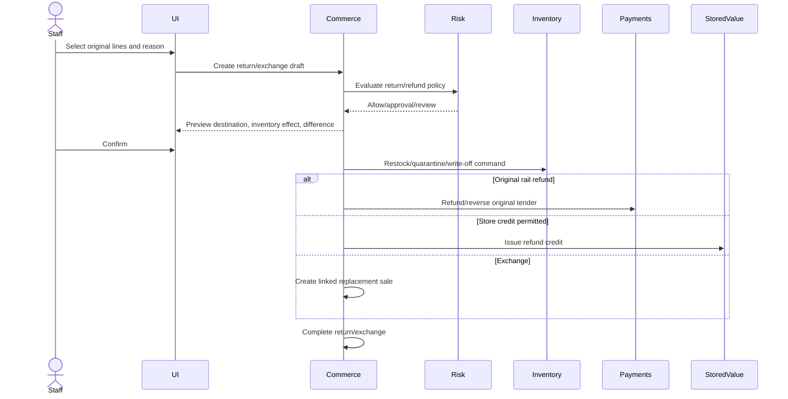
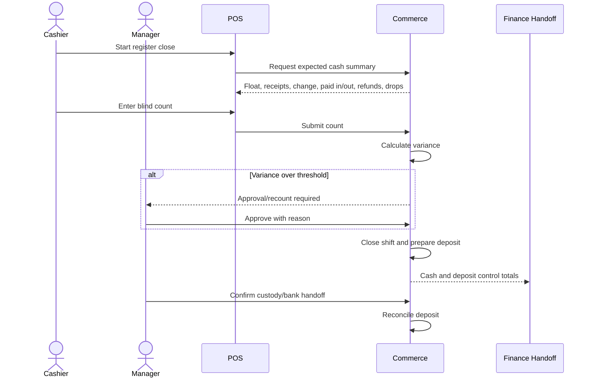
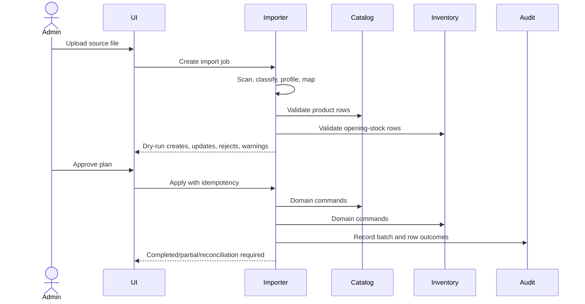
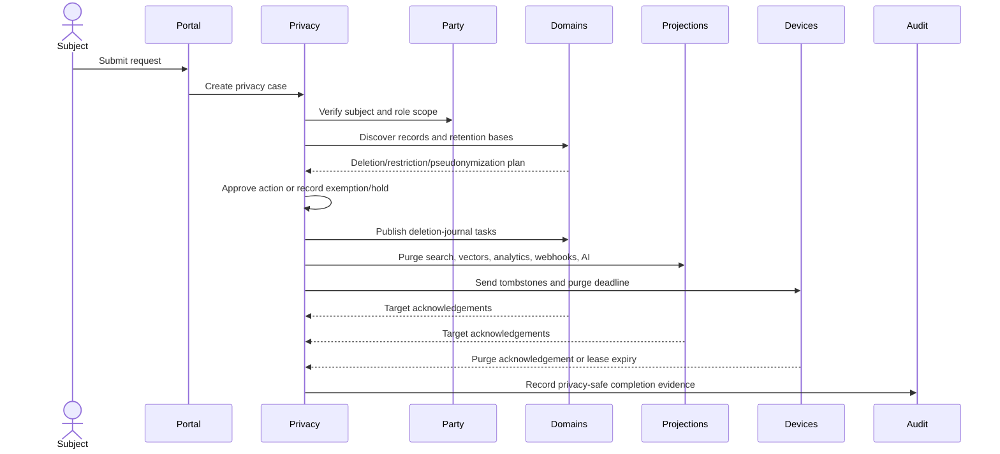
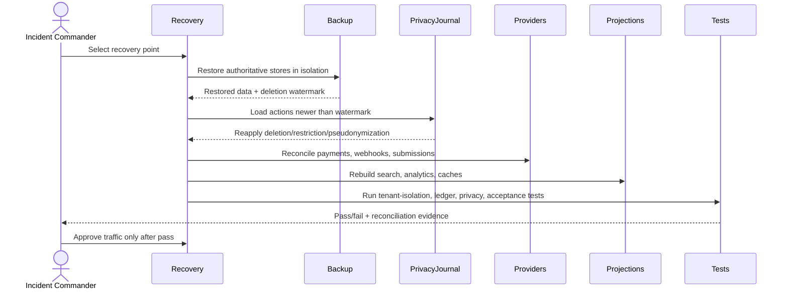

# First Slice Sequence Diagrams

## Purpose

Provide implementation-review sequence diagrams for the eleven load-bearing flows named by `FIRST_SLICE_SYSTEM_CONTEXT_AND_FLOWS.md`.

Every diagram highlights trusted context, authorization, authoritative owner, event publication, audit, provider uncertainty, and recovery behavior.

## 1. Better Auth Login and Tenant Selection



## 2. Online Cash Sale



## 3. Electronic Tender with Uncertain Provider Result

```mermaid
sequenceDiagram
    actor Cashier
    actor Customer
    participant POS
    participant Commerce
    participant Payments
    participant Provider
    participant Reconcile

    Cashier->>POS: Select electronic tender
    POS->>Commerce: Prepare sale
    Commerce->>Payments: Create payment intent
    Payments->>Provider: Start provider operation with idempotency
    Provider-->>Customer: Interactive approval/request-to-pay
    alt Confirmed synchronously
        Provider-->>Payments: Success
        Payments-->>Commerce: Captured/authorized
        Commerce->>Commerce: Complete sale
    else Timeout or unknown
        Provider--xPayments: No definitive response
        Payments-->>Commerce: Uncertain
        Commerce-->>POS: Payment uncertain; do not retry as new charge
        Provider-->>Payments: Later webhook/status
        Payments->>Reconcile: Compare provider and internal state
        Reconcile-->>Commerce: Confirm, reverse, or require review
    end
```

## 4. Offline Lease, Sale, and Synchronization



## 5. Stored-Value Reservation and Capture



## 6. Return, Refund, and Exchange



## 7. Register Close, Cash Variance, and Deposit



## 8. Product and Opening-Stock Import



## 9. Privacy Request and Erasure



## 10. Backup Restore and Reconciliation



## 11. Support Impersonation Approval and Expiry

```mermaid
sequenceDiagram
    actor Agent as Support Agent
    actor Approver
    actor TenantAdmin as Tenant Administrator
    participant Support
    participant Policy
    participant Session
    participant Audit
    Agent->>Support: Request tenant-scoped elevation with reason and ticket
    Support->>Policy: Verify ordinary support permission and tenant policy
    Policy-->>Support: Approval required; no elevated session
    Support->>Approver: Request bounded scope and expiry
    Approver-->>Support: Approve or reject
    Support->>Audit: Record requester, approver, tenant, reason, scope, expiry
    Support-->>TenantAdmin: Publish tenant-visible access notice
    Support->>Session: Mint time-boxed tenant-bound session
    Agent->>Support: Perform permitted action
    Support->>Policy: Re-evaluate scope, permission, entitlement, expiry
    Support->>Audit: Record action and outcome
    Session->>Session: Auto-expire or revoke
    Session->>Audit: Record termination
    Session-->>TenantAdmin: Publish completion and audit reference
```

## Review Checklist

Each implementation diagram derived from these sequences must identify:

- Trusted tenant and actor context
- Authorization and entitlement point
- Authoritative state owner
- Transaction boundary
- Idempotency key
- Canonical event publication
- Audit point
- Data classification
- Failure, uncertainty, retry, and compensation
- Offline and recovery behavior where applicable
