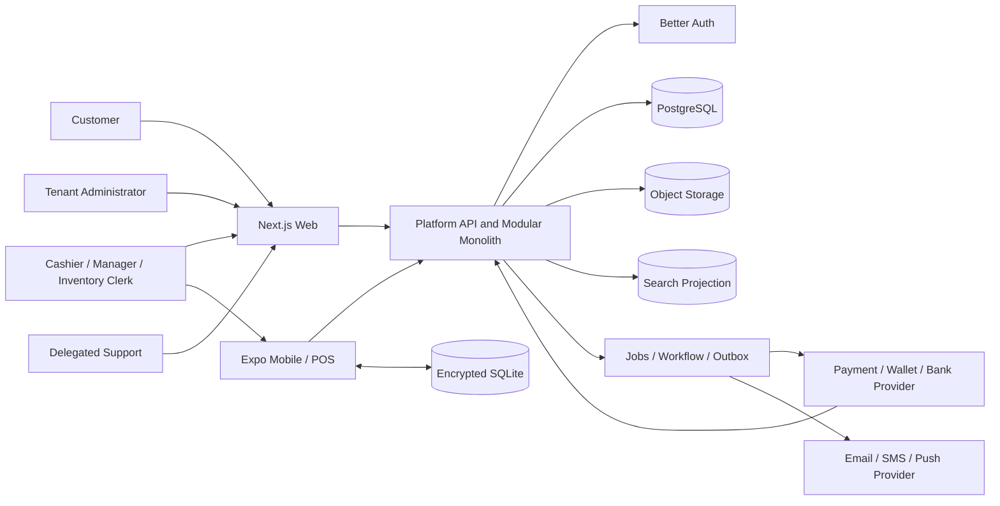

# First Slice System Context and Flows

## Purpose

Define the runtime participants, trust boundaries, authoritative components, consistency boundaries, and principal end-to-end flows for the Guyana retail foundation slice.

This document is a system-flow blueprint. Entity schemas, endpoint contracts, UI specifications, and sequence diagrams remain separate implementation-ready specifications.

## Actors

- Cashier
- Store Associate
- Store Manager
- Inventory Clerk
- Accounting Reviewer
- Tenant Administrator
- Customer
- Partner or support operator with delegated access
- Offline device
- External payment, wallet, bank, communication, and tax/fiscal provider
- Platform operator under restricted authority

## System Context

## Authoritative Components

### Better Auth Adapter

Owns authentication and session mechanics behind the Platform Identity boundary. It does not own Party, employment, customer role, permissions, or entitlements.

### Platform Kernel

Owns tenancy, organizations, Party, authorization, entitlements, configuration, metadata, numbering, audit, events, jobs, notifications, files, search primitives, imports, quotas, devices, offline leases, privacy, secrets, and diagnostics.

### Commerce

Owns sales, returns, registers, shifts, cash movements, receipts, customer stored value, and transaction-specific participant snapshots.

### Product Catalog

Owns product, variant, barcode, category, unit, packaging, media, and lifecycle definitions.

### Inventory

Owns stock ledger, balances, availability, reservation, adjustments, transfers, and counts.

### Payment Engine

Owns tender orchestration and provider transaction state. Tenants contract directly with providers.

### Finance Handoff

Owns posting-rule interpretation, accounting entries where Finance is implemented, and accountant-facing reconciliation outputs. The first slice may use a bounded handoff rather than a complete production Finance domain.

### Security and Operations

Own tenant-isolation assurance, privacy transformations, risk assessments, support controls, monitoring, incident response, and recovery evidence.

## Trust Boundaries

1. Browser or mobile application to Platform API
2. Better Auth session to Platform Identity Link
3. Application layer to domain repositories
4. Domain-to-domain published contracts
5. Online authority to offline device lease
6. Platform to external provider
7. Internal event backbone to external webhook delivery
8. Support operator to tenant context
9. Search, analytics, or AI projection to authoritative record
10. Backup or restored environment to production availability

## Request Context

Every authenticated application request resolves:

- Tenant
- Organization, legal entity, store, and location scope
- User or service identity
- Party and optional domain-role link
- Current permissions
- Current entitlements
- Delegation or support context
- Device and connectivity context
- Locale, timezone, and currency
- Correlation and idempotency identifiers
- Data purpose and classification where required

Clients may propose business values but cannot choose trusted tenant or authority context arbitrarily.

## Flow 1 — Online Cash Sale

1. Cashier begins a sale in the POS workspace.
2. Client loads entitled capabilities, register state, cashier permissions, current catalog projection, and connectivity status.
3. Product scanning or search retrieves authorized catalog and price inputs.
4. Commerce requests Pricing and Tax calculations and Inventory availability.
5. Cashier enters amount received; the deterministic client may calculate change for display.
6. Commerce validates register, transaction, tax snapshot, customer or anonymous-party context, totals, and idempotency.
7. Commerce commits the sale, receipt reference, tender state, cash movement, inventory command intent, and outbox records within approved consistency boundaries.
8. Inventory posts the stock movement through a published contract and publishes its own fact.
9. Document rendering produces the receipt.
10. Finance handoff and reporting projections consume committed facts.
11. The UI shows completed status only after authoritative Commerce success and identifies any downstream pending state separately.

### Invariants

- The client total is never authoritative.
- Cash movement belongs to a valid open register and shift.
- One idempotency key cannot create two sales.
- Inventory and financial handoff can reconcile to the Commerce source.
- Receipt numbering follows the Sequence service.

## Flow 2 — Electronic Tender with Uncertain Provider Result

1. Commerce creates a pending sale and requests a Payment Intent through the Payment Engine.
2. The adapter validates that the tenant's direct provider contract supports the requested operation.
3. Customer completes interactive checkout or approves a request-to-pay.
4. Provider responds synchronously, asynchronously, or not at all.
5. Payment state may become Authorized, Captured, Failed, Cancelled, or Uncertain.
6. Commerce completes the sale only according to the configured payment-state policy.
7. A delayed provider webhook is authenticated, deduplicated, and reconciled.
8. The system never creates a second charge because a user retried an uncertain response.
9. Operators receive a reconciliation queue when internal and provider states disagree.

### Invariants

- Payment state and sale state are distinct.
- Provider identifiers are tenant-scoped references.
- No provider capability is inferred without adapter declaration.
- A UI timeout does not prove payment failure.

## Flow 3 — Stored-Value Issue and Redemption

### Issue

1. Commerce validates program, legal entity, currency, terms, risk, and source transaction.
2. An instrument is created or loaded through the append-oriented stored-value ledger.
3. Payment Engine may collect external tender for the issuance but does not own the balance.
4. Finance receives liability and tender handoff.

### Redeem

1. Payment Engine requests a stored-value authorization from Commerce.
2. Commerce validates instrument, balance, currency, restrictions, expiry, tenant, channel, and risk.
3. Commerce creates an idempotent reservation.
4. The sale completes and captures the reservation, or failure releases it.
5. Returns and chargebacks create reversal or refund entries according to policy.

### Invariants

- Balance is derived from Commerce ledger entries.
- Finance cannot rewrite operational value.
- Loyalty points are not stored value.
- Offline redemption requires signed allowance or pre-reservation.

## Flow 4 — Offline Sale

1. Device authenticates online and obtains a signed offline lease containing tenant, user, store, register, capability, policy, numbering range, and expiry.
2. Required catalog, price, tax, permission, risk-limit, and stored-value allowance projections synchronize into encrypted SQLite.
3. Connectivity is lost.
4. Client permits only operations authorized by the lease and displays offline status.
5. Each operation uses a client-generated opaque identifier and leased human-readable reference.
6. Local transaction, tender, cash, inventory intent, receipt, and audit metadata are written atomically to the device store.
7. On reconnection, the server authenticates device and user, validates lease and operation signatures, and processes queued commands idempotently.
8. Conflicts or policy violations enter explicit reconciliation rather than being silently discarded.
9. Privacy tombstones and revocation state apply before protected data is shown or new work is accepted.

### Invariants

- Offline authority expires.
- No unrestricted provider charge occurs offline unless the rail and risk policy explicitly support it.
- Duplicate synchronization cannot duplicate sale, stock, cash, or stored value.
- A revoked or expired device cannot continue indefinitely.

## Flow 5 — Return and Refund

1. User locates original sale or starts a governed no-receipt flow.
2. Commerce evaluates line eligibility, return window, quantity, condition, customer role, risk, and approval.
3. Inventory receives restock, quarantine, or write-off intent.
4. Payment Engine evaluates the original rail's void, reversal, refund, partial-refund, or manual behavior.
5. Commerce Stored Value may issue store credit only when policy and law allow it.
6. User previews destination, amount, timing, inventory effect, and approval requirement.
7. Confirmed return and refund actions are idempotent and auditable.
8. Finance and provider reconciliation follow the completed source state.

## Flow 6 — Register Close and Cash Deposit

1. Register stops accepting new sales or enters controlled closing state.
2. System calculates expected cash from opening float, cash tenders, change, paid-ins, paid-outs, refunds, and safe drops.
3. Authorized staff count actual cash without the UI unnecessarily biasing the first count.
4. Variance is calculated and classified.
5. Thresholds may require manager review, recount, or investigation.
6. Safe drop and deposit packages are created with custody and bank references.
7. Bank confirmation or reconciliation closes the deposit lifecycle.
8. Cash variance, deposit, and accounting handoff remain traceable to source movements.

## Flow 7 — Product and Opening-Stock Import

1. User uploads a file to a quarantined import area.
2. Platform scans, profiles, classifies, and maps columns to approved domain fields.
3. Domain validation identifies errors, duplicates, unknown references, and proposed custom-field mappings.
4. Dry run shows creates, updates, rejects, warnings, and consequences.
5. User approves the plan.
6. Import orchestrator sends idempotent domain commands; it does not write tables directly.
7. Results and rejects are downloadable and reconciled.
8. A rerun cannot duplicate already accepted rows.

## Flow 8 — Privacy Request and Erasure

1. Privacy request is received and requester authority verified.
2. Party and role relationships identify relevant subject scope.
3. Domain data-location tasks discover authoritative and projected records.
4. Legal holds and retention rules classify each target.
5. Approved actions delete, restrict, generalize, redact, or irreversibly pseudonymize PII without changing economic facts.
6. Deletion journal sends tasks to domains, search, vectors, analytics, webhooks, AI, files, offline devices, and support stores.
7. Required targets acknowledge completion or record an approved exception.
8. Privacy case closes only after obligations are met.
9. A later backup restore reapplies journal entries newer than the backup watermark before traffic.

## Flow 9 — Backup Restore

1. Incident command selects an approved recovery point.
2. Data restores into an isolated environment.
3. Schema, tenant counts, encryption, object references, and journal watermark are verified.
4. Current privacy deletion journal and legal holds are loaded.
5. Newer transformations are reapplied.
6. External providers, outbox, jobs, webhooks, payment states, stored value, inventory, and cash deposits are reconciled.
7. Search and analytical projections are rebuilt.
8. Tenant-isolation and acceptance tests run.
9. Only approved recovery may receive ordinary traffic.

## Domain Transaction Boundaries

One database deployment does not imply one unrestricted transaction boundary.

- Commerce commits its authoritative transaction and outbox atomically.
- Inventory commits stock ledger effects in its own contract boundary.
- Stored value is a Commerce subdomain with its own ledger invariants.
- Payment provider operations remain external and are reconciled.
- Finance postings consume source facts and cannot redefine source transactions.
- Cross-domain completion uses orchestration, idempotency, and compensation rather than shared-table mutation.

## External Provider Failure Policy

Each provider operation declares:

- Timeout
- Retry safety
- Idempotency
- Synchronous and asynchronous success signals
- Uncertain state
- Reconciliation method
- Customer-visible behavior
- Manual override authority
- Fallback or disable policy

## Data Classification Across Flows

- Public: approved storefront or product content
- Internal: ordinary operational configuration
- Confidential: orders, stock, sales, and business metrics
- Restricted: personal, payroll, bank, payment, risk, and investigation data
- Secret: factors, private keys, and provider credentials

Every projection and telemetry path inherits or raises classification; it cannot silently lower it.

## First-Slice Diagram Deliverables

Before implementation review, maintain detailed sequence diagrams for the following flows. Separate data-flow diagrams are deferred until deployable trust-boundary topology exists; every sequence still identifies classification and trust-boundary crossings:

- Better Auth login and tenant selection
- Cash and electronic sale
- Offline lease and synchronization
- Stored-value reservation
- Return and refund
- Register close and deposit
- Product import
- Privacy erasure
- Backup restore
- Support impersonation

Each diagram identifies trust boundary, tenant context, authorization check, consistency boundary, event publication, failure state, data classification, and audit point.