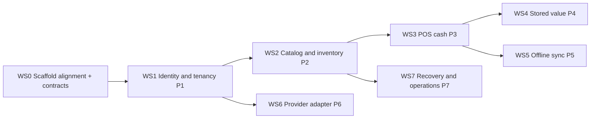

# Meridian First-Slice Implementation Plan

## 1. Purpose and Position

This plan maps the governed planning inputs into concrete engineering workstreams against the real monorepo. It sits **under** the documents it executes and never overrides them:

- `BLUEPRINT_AND_DELIVERY_ROADMAP.md` (PDA-RDM-001) — program phases
- `FIRST_SLICE_MANIFEST.md` (PDA-RDM-003) — scope, 12 acceptance scenarios, change control
- `TECHNICAL_PROTOTYPE_PLAN.md` (PDA-RDM-004) — what each prototype P1–P7 must prove
- `FIRST_SLICE_PROVISIONAL_QUALITY_BUDGETS.md` (PDA-RDM-006) — the numeric targets
- `registry/first-slice.json` — the 103 in-scope capabilities (depth `full`/`prototype`/`seam`) and 13 explicit deferrals

Where this plan and those documents conflict, they win. All work scheduled here proceeds under the ratification-wave **prototype exception**: Draft/Proposed documents guide non-production prototypes that name the decisions they test (chiefly ADR-0020 runtime, ADR-0002/0003 boundaries, ADR-0013 stored-value ownership).

### 1.1 Implementation Posture: Backend Foundation First, Not Entire Backend First

This plan's WS0→WS1 sequencing (§4) already builds contracts and identity/tenancy/authorization before any domain workflow — that is deliberate and correct, but it is **backend-foundation-first, not entire-backend-first**. Building every backend capability before any real frontend exists is explicitly rejected, because it lets APIs get designed without validating real workflows, produces domain models that are elegant but awkward to use, defers permission/navigation/accessibility/offline testing until they are expensive retrofits, risks building endpoints nobody needs, and still forces contract changes once a frontend finally exercises them.

The governed sequence is:

1. **Contract and domain first** — entities, invariants, commands, queries, permissions, entitlements, events, API schemas, and failure/uncertainty states (WS0, and the contract portion of each subsequent workstream).
2. **Foundational backend** — identity, sessions, tenancy, Party linkage, authorization, entitlements, audit, session revocation, tenant isolation (WS1).
3. **Thin experience shell** — just enough frontend to prove the WS1 foundation actually works for a user, before any domain vertical slice is built on top of it. See WS1's exit criteria (§5) for the explicit proof points this shell must demonstrate.
4. **Vertical slices thereafter** — each subsequent workstream (WS2–WS7) delivers API → permission → persistence → event → audit → web UI → mobile/offline behavior → tests as one unit, never backend-only.

**Effort balance for early prototypes (WS0–WS1):** roughly 70% backend and contracts, 20% thin-but-real workflow UI, 10% design-system and integration validation. This ratio is a planning guide for where attention goes, not a budget line item measured in the Definition of Done — later vertical-slice workstreams (WS2 onward) rebalance toward full-stack delivery per slice, since by then the thin shell has already retired the risks this ratio exists to manage.

WS0 and WS1 (Prototype 1) must not be declared exited on backend evidence alone; WS1's Exit criteria below fold in the specific frontend proof points that make this posture verifiable rather than aspirational.

## 2. Baseline: Verified Code Reality (2026-07-14)

**Verified baseline through WS1 PR9:** Bun + Turborepo workspace (`@meridian/*`, ADR-0025/ADR-0026); contract-first Hono/oRPC/OpenAPI boundary; Better Auth behind runtime-neutral Platform Identity; owner-specific PostgreSQL adapters and deterministic migrations; minimum transactional outbox; Tenancy, Organizations, Party linkage, current Authorization, Entitlements, Audit, and session revocation; and the real Next.js Administration shell. PDA-IMPL-005 and the generated first-slice test registry record the controlled-prototype evidence. Exact-head CI is required before merge and does not broaden this baseline into pilot or production authority.

**WS0 package restructuring is complete as of 2026-07-13** (verified: fresh `bun install`, `check-types` 12/12, `test` 126/126, `check`, and `build` all green across the whole workspace). The workspace now matches `registry/architecture-rules.json`'s families:

| Old package | New location | Family |
|---|---|---|
| `@meridian/db` + `@meridian/auth` | `packages/platform/identity` plus `packages/persistence/platform-identity-postgres` | `platform` + `persistence` — Platform Identity exports its factory/port; the owner-specific package holds Better Auth's Drizzle schema and migration; the server composition root owns the only pool |
| `@meridian/api` | Dissolved: router/context/procedures moved into `apps/server`; typed client surface moved to `packages/platform-clients/api-client` (`@meridian/platform-clients-api-client`) | `applications` (router) + `platform-clients` (client type) |
| `@meridian/ui` | `packages/ui-web/core` (`@meridian/ui-web`) | `ui-web` |
| `@meridian/env` | `packages/tooling/env` (`@meridian/tooling-env`) | `tooling` |
| `@meridian/config` | `packages/tooling/config` (`@meridian/tooling-config`) | `tooling` |

The contract-first oRPC/client exception closed in WS1 PR1. The temporary embedded Identity persistence exception closed in PR2 through ADR-0027's owner-specific adapters and composition-owned pool. No exception may be silently recreated for later owners.

**Still does not exist at first-slice implementation depth:** Catalog, Inventory, POS, stored value, offline sync, provider integration, or recovery tooling. The Event Backbone still stops at the minimum transactional outbox; delivery workers and consumers remain later work. Production RLS, OTP/provider evidence, formal accessibility/penetration evidence, operational exercises, and external/founder gates remain open. This section is the honesty anchor: WS1 completion is a controlled-prototype workstream exit, not overall first-slice or production completion.

## 3. Package Architecture Target

Work lands in the families defined by `docs/blueprint/14-Engineering/ARCHITECTURE_DEPENDENCY_RULES.md` and `registry/architecture-rules.json` (contract-only dependencies between families; ADR-0020 runtime neutrality — no Bun globals, `bun:*`, Hono context types, oRPC transport objects, or database adapters inside `foundation`, `contracts`, `platform`, `engines`, `domains`).

Disposition of the six original packages (completed 2026-07-13; see §2's table for the resulting names and locations):

| Package | Disposition |
|---|---|
| `@meridian/db` | Splits under ADR-0027: runtime-neutral owners publish persistence ports; owner-specific `packages/persistence/*` adapters hold concrete schema/migration artifacts while every table and migration retains one authoritative module owner (`single_migration_owner`) |
| `@meridian/auth` | Becomes the internal detail of `packages/platform/identity` (anti-corruption layer; domains never touch auth tables) |
| `@meridian/api` | Dissolves into `apps/server` transport composition plus generated `packages/platform-clients/api-client` |
| `@meridian/ui` | Moves under the `ui-web` family |
| `@meridian/env`, `@meridian/config` | Move to `tooling`/`foundation` as appropriate |

Any package left outside a family carries a recorded exception **with expiry** in `registry/architecture-rules.json` (tracked as technical debt TD-001/TD-002 in the Architecture Risk Register).

## 4. Workstreams and Sequencing

| Workstream | Blocked by | Parallel lane notes | External gates |
|---|---|---|---|
| WS0 | — | Single lane; everything depends on it | — |
| WS1 (P1) | WS0 | — | — |
| WS2 (P2) | WS1 | — | — |
| WS3 (P3) | WS2 | — | — |
| WS4 (P4) | WS3 | May run beside WS5 | — |
| WS5 (P5) | WS3 | Client sync engine may start after WS1 (designated parallel lane) | — |
| WS6 (P6) | WS1 (engine); WS3 (POS tender integration) | Designated parallel lane (contract-driven) | Provider sandbox work gated on FDR-002/FDR-007 |
| WS7 (P7) | WS2 (needs real ledgers/outbox) | Completes last, after WS4/WS5 | — |

**Parallelism rule (solo founder + AI agents): at most two active workstreams.** The designated parallel lanes are WS6 engine work and WS5 client sync, because they are contract-driven and do not contend on the same packages. One issue, one branch, one worktree, one PR per independently mergeable change (`WORKTREE_CHANGE_AND_RELEASE_COORDINATION.md`).

## 5. Workstream Definitions

Template per workstream: **Why · Entry · Proves · Packages · Contracts · Tests · Exit · Gates.** "Proves" cites PDA-RDM-004 and is not restated here.

### WS0 — Scaffold Alignment and Contract Materialization — **complete (2026-07-13)**

- **Why:** The contracts and rules exist only as registry artifacts; code that grows before the package families and generated contracts exist will calcify in the wrong shape and every later workstream inherits the misalignment.
- **Entry:** none (first work).
- **Proves:** n/a (pre-prototype enabling work; validates ADR-0025 layout + architecture-rules enforceability).
- **Packages:** NEW `packages/contracts/*` (types generated/derived from OpenAPI, events, permissions registries), NEW `packages/foundation/core` (opaque ids, money/decimal per CLAUDE §7, result/error taxonomy, time semantics); restructure of the six existing packages per §3; dependency-rule enforcement wired into CI (architecture tests per `ARCHITECTURE_DEPENDENCY_RULES.md`).
- **Contracts:** `openapi/first-slice-v1.yaml`, `registry/events.json`, `registry/permissions.json` as codegen sources — generated code never hand-edited.
- **Tests:** foundation unit tests (money/id/time invariants); architecture tests fail on any forbidden import; all existing gates stay green through the restructure.
- **Exit:** families in place or exceptions-with-expiry recorded; contracts package consumed by `apps/server`; DoD §6. **Satisfied:** all six original packages now sit in their target families or a tracked, expiring exception (see §2); fresh install/typecheck/test/lint/build all pass (126 tests, 0 failures, 12/12 packages typecheck clean). Automated architecture-rules import-graph enforcement (the "architecture tests" bullet above) does not exist yet as a CI-enforced check — it is recorded as a gap for a follow-up workstream, not silently assumed done.
- **Gates:** none external.

### WS1 — Identity, Tenancy, Party, Authorization (P1) — **complete at controlled-prototype depth (2026-07-14)**

- **Why:** Every subsequent behavior is meaningless without enforceable tenant scope and separated authentication/Party/permission/entitlement concepts — retrofitting isolation is the most expensive failure in multi-tenant systems, and the audits' hardest rules (Better Auth owns sessions only; Party owns identity; domains own roles) must be encoded before any domain exists to violate them.
- **Detailed plan:** `WS1_IDENTITY_TENANCY_PARTY_AUTHORIZATION_PLAN.md` (PDA-RDM-008) — governance gates, package boundaries, canonical contract surface, PR sequence (PR1–PR9), fixtures, evidence matrix, and exit gate. This entry stays the authoritative summary; PDA-RDM-008 does not override it.
- **Entry:** WS0 done. PR1 closed TD-007 before any domain package was built against the former router-coupled client shape.
- **Proves:** PDA-RDM-004 §Prototype 1.
- **Packages:** Implemented `platform/tenancy`, `platform/authorization`, `platform/entitlements`, `platform/audit`, minimum `platform/events`, extended `platform/identity`, `domains/party`, and owner-specific `packages/persistence/*` adapters under ADR-0027's controlled-prototype evidence.
- **Contracts:** identity/tenancy/user-admin operation group (`/me`, `/session/active-context`, `/organizations`, `/users*`, `/roles`, `/role-assignments`, `/entitlements`, `/parties*`, `/audit-records` — per `registry/endpoint-permissions.json`); `platform.*` and `party.*` event families.
- **Tests:** dominant dimensions `tenant_isolation`, `permission_and_entitlement`, `audit_and_observability` for the in-scope `platform.*`/`party.records` capabilities; budgets: session/permission checks inside the 750ms p95 sale path allowance; credential revocation ≤60s p95; two-tenant isolation proof (acceptance scenario 1).
- **Exit:** scenario 1 demonstrated; Better Auth tables invisible to domain code (architecture test); **the thin experience shell required by §1.1 is real and demonstrated, not stubbed** — specifically:
  - Login works end to end against the real identity/session backend
  - Tenant and organization switching is visible and functionally changes context (not just a UI toggle)
  - Party linkage is visible for the authenticated user
  - Permissions actually alter available actions in the shell (not just visually disable them — an unauthorized action must be rejected server-side too)
  - Entitlements alter available capabilities without being presented as permissions (the two must be visually and semantically distinguishable per `COMPONENT_CATALOG_AND_STATE_MATRIX.md`'s "Permission denied" vs. "Entitlement unavailable" states)
  - Session revocation is understandable to the user (a revoked session produces a clear, non-alarming re-authentication path, not a silent failure or an opaque error)
  - The shell is responsive (narrow mobile through wide desktop) and passes basic keyboard and screen-reader navigation per `FIRST_SLICE_UX_AND_ACCESSIBILITY.md`
  - Navigation in the shell honors `NAVIGATION_COMMAND_PALETTE_AND_GLOBAL_SEARCH.md`'s depth and context-visibility rules even at this early stage (role-based primary navigation, visible tenant/organization context) — it does not need every workspace built yet, but the shell it does have must not violate the navigation contract it will keep growing under
  - The same critical contracts and shell behavior are verified under both Bun and the Node fallback (ADR-0020)
  - DoD §6.
- **Exit disposition:** satisfied for the controlled prototype by PDA-IMPL-005, PDA-UX-038, `evidence/first-slice/ws1-capability-evidence.json`, and `registry/first-slice-tests.json` (11 capabilities, 143 required cells). The residual production/external gates remain explicit; no ADR or Draft specification is self-ratified by implementation.
- **Gates:** Better Auth plugin matrix deny-by-default honored (no new plugins without matrix disposition).

### WS2 — Catalog and Inventory Ledger (P2)

- **Why:** Inventory is the first append-only business ledger — it proves the platform's correction-by-reversal doctrine, outbox eventing, and domain data ownership on the least regulated ledger before money is at stake.
- **Entry:** WS1 done.
- **Proves:** PDA-RDM-004 §Prototype 2.
- **Packages:** NEW `domains/catalog`, `domains/inventory` (own schemas/migrations), EXTEND the minimum `platform/events` transactional outbox introduced by WS1 into publication/consumer infrastructure, NEW `platform/numbering` (sequence service consumed later by receipts).
- **Contracts:** `/products*`, `/product-imports*`, `/opening-stock-imports`, `/stock-balances`, `/inventory-adjustments*`, `/stock-counts*`, `/stock-transfers*`; `catalog.*` + `inventory.*` events (registered in `registry/events.json`).
- **Tests:** dominant dimensions `idempotency_and_duplicate`, `concurrency_and_conflict`, `events_jobs_and_projections`; budgets: inventory ledger 99.95% correctness; barcode lookup 300ms p95; search 800ms p95; outbox 99.99% eventual publication.
- **Exit:** scenarios 2 and 8 demonstrated; ledger corrections only by reversal; DoD §6.
- **Gates:** none external.

### WS3 — POS Cash Workflow (P3)

- **Why:** The cash sale is the beachhead's economic heartbeat and the platform's first legally meaningful artifact chain (receipt numbering, register custody, accountant handoff) — cash-first matches Guyana reality and defers all provider risk.
- **Entry:** WS2 done.
- **Proves:** PDA-RDM-004 §Prototype 3.
- **Packages:** NEW `domains/pos`; `engines/pricing`, `engines/tax` (prototype depth, values from `GUYANA_RETAIL_PROTOTYPE_TAX_PACK.md` — explicitly non-statutory).
- **Contracts:** `/registers/*` (open/close/cash-movements/safe-drops), `/sales*`, `/receipts/*` (reissue/void), `/deposits*`, `/refunds*`, `/returns*`, `/exports/accountant-handoff` (+ `FIRST_SLICE_FINANCE_HANDOFF_CONTRACT.md`, `schemas/finance/finance-handoff-v1.schema.json`); `commerce.*` sale/register/return events.
- **Tests:** dominant dimensions `happy_path`, `validation_and_denial`, `recovery_replay_and_reconciliation`; budgets: median cash sale ≤30s (P90 ≤60s), platform processing 750ms p95 / 1.5s p99, add-scanned-item 100ms p95, POS route JS ≤350KB target; receipt numbering offline-safe (via `platform/numbering`).
- **Exit:** scenarios 3, 4, 6, 9, 10 demonstrated end-to-end; DoD §6.
- **Gates:** tax values remain prototype-only (production statutory behavior stays machine-deferred: `fiscalization.submissions`).

### WS4 — Stored Value (P4)

- **Why:** Customer balances are financial liabilities; they cannot live inside POS. ADR-0013 makes Commerce their owner precisely so redemption, reversal, and reconciliation carry ledger-grade discipline — the 99.99% correctness budget is the platform's strictest and must be earned by design, not patched in.
- **Entry:** WS3 done.
- **Proves:** PDA-RDM-004 §Prototype 4.
- **Packages:** NEW `domains/stored-value` (append-only instrument/ledger schema, own migrations).
- **Contracts:** `/stored-value-instruments*` (issue/load/adjust/suspend/reserve), `/stored-value-reservations/*` (capture/release), `/stored-value-reconciliations`; `commerce.stored-value-*` events (7 registered).
- **Tests:** dominant dimensions `idempotency_and_duplicate`, `concurrency_and_conflict`, `privacy_and_classification`; budgets: **99.99% ledger correctness, zero unexplained monetary divergence**; reservation semantics under concurrent redemption; fraud velocity limits (local hard limits per LOYALTY/RISK boundary).
- **Exit:** scenario 7 demonstrated incl. reversal and reconciliation to the Finance handoff; DoD §6.
- **Gates:** GYD single-currency per instrument (FDR-003 assumptions); no loyalty conversion (ADR-0009/0013 boundary).

### WS5 — Offline Sync (P5)

- **Why:** Guyanese connectivity makes offline-first a market requirement, not a feature — and offline correctness (leases, idempotent replay, tombstones) is architecture that cannot be bolted on after the sync-less version ships.
- **Entry:** WS3 done (client sync-engine work may start after WS1 in the parallel lane).
- **Proves:** PDA-RDM-004 §Prototype 5.
- **Packages:** NEW `platform/devices`, `platform/offline-sync` (server); `platform-clients/offline` (runtime-neutral SQLite sync engine consumed by `apps/native`).
- **Contracts:** `/devices/*` (enroll/revoke), `/offline-leases`, `/sync/batches`, `/sync/status/*`; `schemas/offline/sync-batch-v1.schema.json` (signed, versioned, idempotent, bounded).
- **Tests:** dominant dimensions `offline_and_degraded`, `idempotency_and_duplicate`, `privacy_and_classification`; budgets: 24h lease default, queue ack 5s p95, 1,000 ops sync ≤10min p95, **zero duplicate business effects**, unresolved conflicts <0.5%, tombstone 5min p95, revoked device denied ≤60s p95.
- **Exit:** scenarios 5 and 11 (offline sale + privacy tombstone) demonstrated; DoD §6.
- **Gates:** native auth remains blocked until the Better Auth Expo integration passes its matrix preconditions (register RR-001).

### WS6 — Provider Adapter (P6)

- **Why:** Provider capability must never be assumed (audit doctrine) — a simulator that exercises delayed results, duplicate webhooks, and uncertain states builds the adapter discipline before any real MMG/bank contract exists, so provider onboarding later is configuration, not architecture.
- **Entry:** engine after WS1; POS tender integration after WS3.
- **Proves:** PDA-RDM-004 §Prototype 6.
- **Packages:** NEW `engines/payments` (provider-neutral intent/confirmation state machine, `payment.*` per ADR-0017), `integrations/payment-simulator` (SDK types never leak past the adapter — `provider-type-leak` rule).
- **Contracts:** `/payment-intents*` (create/confirm/refund/reverse), `/payment-reconciliations`, `/webhook-subscriptions*`, `/webhook-deliveries/*`; `payment.*` events (11 registered), `developer.webhook-*` events.
- **Tests:** dominant dimensions `recovery_replay_and_reconciliation`, `idempotency_and_duplicate`; simulator scenarios per `REFERENCE_INTEGRATIONS_AND_PROVIDER_SIMULATORS.md`: request-to-pay, delayed result, duplicate callback, uncertain state, refund seam, reconciliation mismatch.
- **Exit:** mixed-tender sale (scenario 3) through the simulator; DoD §6.
- **Gates:** **real provider sandbox work blocked on FDR-002 (legal entity) and FDR-007 (provider coverage)** — simulator-only until then.

### WS7 — Recovery and Operations (P7)

- **Why:** A platform holding money-like ledgers has no right to exist without proven restore — and the deletion-journal replay after restore is the privacy architecture's moment of truth (FA4-verified design, never yet executed).
- **Entry:** WS2 done (needs real ledgers and outbox); completes after WS4/WS5.
- **Proves:** PDA-RDM-004 §Prototype 7.
- **Packages:** `tooling/ops` scripts + `ops/` runbook automation against the compose stack; no new domain packages.
- **Contracts:** none new; exercises `BACKUP_RESTORE_AND_DISASTER_RECOVERY.md` 12-step restore, deletion-journal watermark, outbox recovery, search rebuild.
- **Tests:** dominant dimension `recovery_replay_and_reconciliation` across all in-scope capabilities; budgets: **RPO 5min / RTO 4h (PostgreSQL and money ledgers), one measured restore recorded** — pilot-entry requirement; no duplicate payment/stored-value/fiscal side effects after replay.
- **Exit:** scenario 12 demonstrated with measured RPO/RTO; operational exercise template completed; DoD §6.
- **Gates:** none external.

## 6. Definition of Done (every workstream)

1. Every in-scope capability's row in `registry/first-slice-tests.json` carries recorded evidence for each required dimension (overrides for seams per `capability-metadata.json`).
2. Applicable PDA-RDM-006 numeric budgets **measured and reported** — pass, or a dispositioned variance. Never asserted.
3. Contract conformance: implemented surface diffed against OpenAPI, endpoint-permissions, and events registries — zero undeclared drift (CI markdown-endpoint and parity lints stay green).
4. Architecture-rules compliance: no forbidden imports; portable critical suites pass on **both Bun and Node** (ADR-0020).
5. All five local gates plus CI (including Docker stack, migration freshness, health probes) green.
6. `TECHNOLOGY_LIFECYCLE_AND_LESSONS.md` ledger entry appended (versions, evidence dates, workarounds, lessons).
7. Linked FDR items and ratification-wave rows updated or explicitly recorded as still-open blockers; Architecture Risk Register updated (closures with evidence; **new technical debt declared in the same PR that accepts it**).
8. **Vision conformance (North Star):** the essential workflow completes with AI disabled; UX budgets measured, not claimed; the exit record answers "would we rather exclude this than ship it below best-in-class?" with evidence or an explicit deferral.
9. **Delete discipline:** the exit record lists removals — retired assumptions, deprecated/merged docs, deleted code and contracts — not only additions.

## 7. Milestones (Ordered, Not Dated)

M0–M7 are the exit gates of WS0–WS7. **No calendar dates are given because none would be honest**: the delivery organization is one founder plus AI agents, and gate conditions replace schedule. Each M-gate triggers an incremental verification per `FABLE5_STANDING_AUDIT_CHARTER.md` (register-first; ADR health sweep at M1/M3/M5/M7). Capability-maturity modeling beyond the existing depth classes (`full`/`prototype`/`seam` + test evidence states) is **deliberately deferred** until after M3, when real evidence exists to grade.

## 8. Non-Goals

Everything in PDA-RDM-004 §Non-Goals, by reference. Additionally: no production deployment of any workstream output; nothing beyond the 103 registered capabilities (the 13 explicit deferrals stay deferred, including production fiscal submission, recurring commerce, customer-account tender, and payment facilitation); no new ADRs are implied by this plan — any boundary-affecting discovery routes through the ADR process.

## 9. Change Control

Scope changes route through PDA-RDM-003 §Change Control (doc + `registry/first-slice.json` together, founder approval where commercial/regulatory). Budget changes route through PDA-RDM-006. This document only re-sequences work; a change to *what* is built is never made here.

## 10. Open Risks

- **FDR-002 (platform legal entity)** — critical path for WS6 provider sandboxes and everything commercial; tracked in the Founder Decision Register.
- **FDR-004** — first-slice scope remains provisionally adopted, not ratified; M0 is a natural ratification checkpoint.
- **Drizzle ledger suitability** — per the technology ledger, verify complex ledger query/migration behavior at implementation lock (WS2 entry); Kysely remains the recorded alternative.
- **Windows contributor environment** — Turbopack MAX_PATH and long-path issues are recorded in the docs troubleshooting page; CI (Linux) is authoritative.
