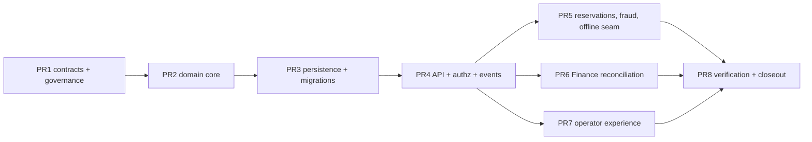

# WS4 Implementation Plan: Stored Value

## 1. Purpose, Authority, and Lifecycle

This document expands `FIRST_SLICE_IMPLEMENTATION_PLAN.md` (PDA-RDM-007) section "WS4 — Stored Value (P4)" into the implementation-control plan for Technical Prototype 4. It defines the capability depth, owners, package boundaries, contract corrections, pull-request sequence, parallel execution lanes, autonomous-agent execution protocol, evidence, and exit gates that will govern WS4 once its entry gate is recorded.

This is a **Draft preparatory plan for a controlled prototype that has not been entered**. Publishing it advances no workstream stage, satisfies no gate, and claims no progress — exactly as PDA-RDM-007 already provides for WS5/WS6 preparatory design. It does not ratify ADR-0013, disposition FDR-003, promote any Draft source, authorize a pilot or production deployment, or establish a contractual service level. If this plan conflicts with the Constitution, a ratified or accepted ADR, or a higher-authority approved specification, the higher-authority source wins and work stops for disposition.

### 1.1 Entry gate and execution authorization

WS4 implementation may begin only when **both** of the following are recorded:

1. WS3 is done, and
2. the M3 standing-audit charter checkpoint records the general P4–P7 entry-clearance disposition against completed P3 evidence (PDA-RDM-007 §7).

Neither condition is met at authoring time. WS3 remains blocked on issue #94 (restricted raw-evidence handling) and issue #82 (retained real-world customer evidence); FDR-012's controlled-prototype exception names only WS3 and the isolated branch `claude/ws3-integration` — **it does not extend to WS4**. No analogous exception exists for WS4. If the Founder later wants WS4 implementation to begin ahead of M3, that requires a new recorded founder decision naming an isolated branch and the gates that continue to bind entry recording, merge to `main`, and progress claims; this plan cannot substitute for that decision.

Work permitted **now**, before entry: maintaining this plan, contract-precision reconciliation that corrects already-registered draft artifacts (only through normal governed PRs), and UI pattern research under §10 that produces no production code claims. Such hygiene PRs are ordinary governance work, not early PR1 execution: they claim no WS4 progress, and if they land, PR1's reconciliation scope becomes *verifying* the §2.2 ledger rather than redoing it, with G5 satisfied by that verification. Work **not** permitted now: creating `domains/stored-value` or persistence packages, freezing schemas, recording WS4 entry, or advancing `PROGRAM_STATUS.md`.

### 1.2 Governing sources

| Concern | Governing source |
|---|---|
| Authority and lifecycle | PDA-FND-002; repository `AGENTS.md` |
| First-slice scope and depth | PDA-RDM-001, PDA-RDM-003, PDA-RDM-004, PDA-RDM-006, PDA-RDM-007, `registry/first-slice.json` |
| Stored-value ownership and semantics | ADR-0013 (**Proposed**), PDA-DOM-025, PDA-DOM-001 |
| Loyalty boundary | ADR-0009 (**Proposed**); non-cash value never silently converts to monetary liability |
| Entity states and invariants | PDA-ARC-013 (`FIRST_SLICE_ENTITY_AND_STATE_MODEL.md`) §Stored Value Entities, §Invariants |
| Modular boundaries | ADR-0002, ADR-0003, PDA-ENGR-012, `registry/architecture-rules.json` |
| Runtime and persistence | ADR-0020, ADR-0027, PDA-ENGR-013 |
| Events and transactions | ADR-0016, PDA-ARC-005, PDA-PLT-008 |
| Permissions and entitlements | PDA-PLT-004, PDA-PLT-005, PDA-PLT-027, permission and endpoint registries |
| Currency and settlement authority | **FDR-003 (Open)** — named PR1 schema-freeze blocker |
| Domain dependency contracts | PDA-DOM-022 §"Stored Value within Commerce" |
| Finance handoff | PDA-DOM-026, `schemas/finance/finance-handoff-v1.schema.json` |
| Privacy and classification | ADR-0014, PDA-DAT-010, PDA-SEC-011 |
| Quality budgets | PDA-RDM-006 — stored-value ledger posting 99.99%, zero unexplained monetary divergence |
| Evidence | PDA-TST-013, `registry/first-slice-tests.json`, PDA-RDM-007 §6 (DoD) |
| Work coordination | PDA-ENGR-014, `WORKTREE_CHANGE_AND_RELEASE_COORDINATION.md`, the GitHub Project |
| Working practice | `ENGINEERING_NOTEBOOK.md` multi-agent independent review discipline |

ADR-0013 and ADR-0009 are **Proposed**, not Accepted. Under the lifecycle rule they may guide only this named controlled prototype, which explicitly tests them; WS4's exit evidence is intended to become part of the promotion case for ADR-0013. Production implementation may not rely on them until they are Accepted.

## 2. Verified Starting State and Reconciliation Ledger

The baseline below was independently verified against the working tree at authoring time (branch `claude/remote-control-0974e7`, from `main` at `da38611`). Counts are the starting point, not immutable targets; PR1's approved corrections will change them, after which generated registries are the exact source.

### 2.1 Registered surface

| Artifact | Verified state |
|---|---|
| Capabilities | `commerce.stored-value` (full, deps: `commerce.stored-value-ledger`, `security.risk-policies`, offline `AllowanceLimited`); `commerce.stored-value-ledger` (full, deps: `platform.audit`, offline `QueueAndReconcile`); `commerce.store-credit` (full, **namespace-default metadata, no explicit deps**); `commerce.gift-cards` (full); `commerce.gift-receipts` (prototype); all owner Commerce, status Draft |
| Permissions | 8 registered: `commerce.stored-value.{adjust,issue,load,read,reconcile,redeem,reserve,suspend}` |
| Endpoints | 9 operations exist in `openapi/first-slice-v1.yaml` and map 1:1 in `registry/endpoint-permissions.json`: instrument create/read/load/reserve/adjust/suspend, reservation capture/release, reconciliation create |
| Events | 7 registered `commerce.stored-value-*` v1 events (issued, load.posted, redemption.reserved, redemption.captured, entry.reversed, balance.expired, instrument.suspended) |
| Event schemas | **Zero** of the 7 events resolve to a JSON Schema under `schemas/events/` |
| Test matrix | `registry/first-slice-tests.json` scaffolds `commerce.stored-value` and `commerce.stored-value-ledger` with all 13 dimensions required, evidence status Planned, zero evidence; `commerce.store-credit`, `commerce.gift-cards`, `commerce.gift-receipts` carry their own rows |
| Packages | No `packages/domains/stored-value`, no `packages/persistence/stored-value-postgres` — greenfield |
| Architecture rules | No stored-value owner registration in `registry/architecture-rules.json` |

### 2.2 Accepted gaps and contradictions

| Verified fact or gap | Disposition | Closure |
|---|---|---|
| ADR-0013 and ADR-0009 are Proposed, not Accepted | Accepted lifecycle constraint | WS4 runs as the named controlled prototype testing them; exit evidence feeds their promotion case; no production reliance until Accepted |
| FDR-003 (currencies, FX, rounding, settlement) is Open with operating assumptions | Accepted blocking dependency | **PR1 schema freeze may not occur until FDR-003 is dispositioned.** Until then GYD single-currency-per-instrument is an assumption, and every monetary schema field carries explicit currency so a later FDR-003 outcome is additive, not corrective |
| PDA-RDM-007 §WS4 says `domains/stored-value` owns "own migrations" | Accepted contradiction with ADR-0027 | Same correction WS2 recorded: the domain core package owns behavior and ports; `persistence/stored-value-postgres` owns concrete PostgreSQL schema and migrations. PR1 corrects PDA-RDM-007 wording and registers both owners |
| `commerce.store-credit` and `commerce.gift-cards` are separate registered capabilities while PDA-DOM-025 models gift cards and store credit as **instrument types** of one stored-value family | Accepted reconciliation need | This plan maps all four capability IDs onto the single `domains/stored-value` package: `commerce.stored-value-ledger` is the append-only ledger, `commerce.stored-value` the orchestration surface, `commerce.store-credit` and `commerce.gift-cards` instrument-type coverage within them. PR1 records explicit dependency metadata for the two namespace-default entries. Capability IDs are not merged or renamed |
| `commerce.gift-receipts` sits in the registry near stored value | Accepted boundary clarification | Gift receipts are a receipt/return presentation concern owned by the WS3 receipts surface, not a monetary instrument; WS4 claims no gift-receipt evidence. If reconciliation shows otherwise, stop and disposition — do not absorb silently |
| Zero event schemas exist for the 7 registered events | Accepted gap (WS2 precedent) | PR1 supplies canonical JSON Schemas for every event WS4 will emit, or records an explicit non-production deferral per event |
| Ledger facts Release and Adjust have no corresponding registered events; PDA-ARC-013 also lists Activate, Refund, Expire-reversal (Reinstate), Transfer Out/In facts | Accepted gap found during reconciliation | PR1 proposes a reservation-released event and an adjustment-posted event in the `commerce.stored-value-*` family — exact identifiers are registered under the canonical event grammar only through PR1 propagation across sources, registries, and schemas together — and records an explicit event-or-deferral decision for every remaining ledger fact. Transfer/merge stays deferred per PDA-DOM-025 §Initial Scope |
| OpenAPI parameter naming is inconsistent: `{instrumentId}` on reserve, `{id}` elsewhere | Accepted contract-precision defect | PR1 normalizes parameter naming across all stored-value operations |
| No list/history read contracts exist (no instrument list, no ledger-entry history, no reservation read, no reconciliation read) | Accepted gap found during reconciliation (WS2 PR1 precedent) | PR1 adds the minimum tenant-scoped read operations required by reloadable UI workflows, audit review, and reconciliation evidence |
| Exact currency minor-unit and rounding library is an Open Schema Decision (PDA-ARC-013 §Open Schema Decisions) | Accepted blocking design decision | PR1 records the money-representation decision (explicit currency, approved exact decimal/integer semantics, never binary floating point — Constitution §7), reusing the WS2 Drizzle exact-decimal spike evidence, and appends it to `TECHNOLOGY_LIFECYCLE_AND_LESSONS.md` |
| Offline allowance semantics depend on device trust that WS5 owns | Accepted scope seam | WS4 proves reservation/allowance ledger semantics with an explicit seam: signed device allowances, leases, and sync transport are WS5. WS4's offline evidence is limited to allowance accounting, duplicate-use controls, and the reconciliation queue |

## 3. Mandatory Pre-Implementation Gates

No WS4 implementation PR opens until every gate below is recorded:

- **G1 — Entry authority.** The M3 charter checkpoint disposition (or a founder-recorded WS4-specific controlled-prototype exception naming an isolated branch) exists in writing. This plan cannot create it.
- **G2 — FDR-003 disposition before schema freeze.** PR1 may draft schemas, but the freeze that PR2+ builds on requires FDR-003 dispositioned. If the Founder records a bounded interim decision (e.g., GYD-only for the prototype), that decision is cited verbatim in PR1.
- **G3 — Money representation decision.** The minor-unit/rounding decision from §2.2 is recorded with evidence before any migration is authored.
- **G4 — Owner registrations.** `domains/stored-value` (core) and `persistence/stored-value-postgres` (PostgreSQL owner) are registered in PDA-ENGR-012 source ownership and regenerate cleanly into `registry/architecture-rules.json` with positive and negative ownership tests, before either package lands code.
- **G5 — Contract reconciliation complete.** Every §2.2 contract correction has propagated through source documents, OpenAPI, permission/endpoint/event registries, and schemas together — no partial propagation.
- **G6 — Payment and Loyalty boundary restated.** The PR1 contract package records: Payment Engine requests stored-value authorization from Commerce and never owns balances (PDA-DOM-022 prohibited shortcut); Finance never rewrites the ledger; Loyalty value never enters this ledger (ADR-0009 required control: an automated test proves monetary stored value cannot enter the Loyalty ledger and vice versa).
- **G7 — Fixture baseline.** The Demerara Retail Test Group fixture is extended with stored-value programs, instruments, and two-tenant isolation data before PR2 asserts behavior against it.

## 4. Package and Ownership Plan

Per ADR-0002/0003/0020/0027, mirroring the Catalog/Inventory precedent:

| Package | Role | Constraints |
|---|---|---|
| `packages/domains/stored-value` | Commerce-owned stored-value core: aggregates, ledger fact model, state machines, ports, domain services | Runtime-neutral (no Bun globals, no Hono/oRPC types, no database adapter); owns behavior, not concrete schema |
| `packages/persistence/stored-value-postgres` | Concrete PostgreSQL schema, Drizzle migrations, repository adapters | Owner-specific per ADR-0027; append-only ledger tables; no other domain imports its tables or migrations |
| `packages/contracts` (extend) | Stored-value command/query/event contract types, zod v4 boundary schemas | Contract additions land with PR1 reconciliation, not ad hoc |
| `apps/server` (extend) | oRPC/HTTP surface mounting the stored-value API | Declares permissions per operation; typed errors |
| `apps/web` (extend) | Operator experience (§10) | Governed UI rules only |

Explicitly **not** created in WS4: any Payment Engine package (`engines/payments` is WS6), any Loyalty package, any Finance posting engine. The POS tender integration point is designed as a contract seam consumed later by WS3+WS6 composition.

## 5. Ledger Semantics and Shared Vocabulary

The domain model implements PDA-DOM-025 and PDA-ARC-013 exactly; divergence stops for disposition.

- **Entities and states.** Program (Draft/Active/Suspended/Closed); Instrument (Created/Inactive/Active/Suspended/Expired/Closed); Reservation (Active/Captured/Released/Expired/Reconciliation Required); Ledger Entry facts: Issue, Activate, Load, Reserve, Release, Redeem, Refund, Reverse, Expire, Reinstate, Adjust, Transfer Out, Transfer In (transfer facts modeled but behind the PDA-DOM-025 deferral — no transfer command surface in WS4).
- **Append-only with linked reversal.** Balances derive from entries; posted entries are never mutated or deleted; corrections are linked reversal + replacement entries (Constitution: reversal/compensation for stored-value facts).
- **Entry completeness.** Every entry records tenant, legal entity, program, instrument/account, currency, value, source transaction, channel, operator, timestamps, idempotency key, rule version, and correlation identifiers (PDA-DOM-025 §Ledger Model).
- **Money.** Explicit currency on every monetary field; exact decimal/integer semantics per the G3 decision; one issued currency per instrument (current FDR-003 operating assumption, revisited at G2).
- **Idempotency.** Issuance, load, reservation, capture, release, and adjustment are idempotent by client-supplied idempotency key; duplicate submission returns the original outcome. Offline-created entries use globally unique client identifiers (PDA-ARC-013 invariant 6).
- **Concurrency.** Reservation and redemption under concurrent access serialize through the persistence adapter such that available balance never goes negative and no double-capture is possible; this is a PR3/PR5 evidence obligation, not an assumption.
- **Identity.** Opaque internal identifiers; human-readable instrument references issued via `platform/numbering`; anonymous instruments minimally identifiable; registered accounts link to Party through a scoped reference with ADR-0014 pseudonymization preserving financial facts.

## 6. Canonical Contract Surface

Target surface after PR1 reconciliation (all tenant-scoped, all declaring permissions):

| Operation | Permission | Notes |
|---|---|---|
| `POST /v1/stored-value-instruments` | `commerce.stored-value.issue` | Idempotent issuance; instrument type gift-card or store-credit |
| `GET /stored-value-instruments` (proposed) | `commerce.stored-value.read` | **New in PR1** — tenant-scoped list |
| `GET /v1/stored-value-instruments/{id}` | `commerce.stored-value.read` | Existing |
| `GET /stored-value-instruments/{id}/entries` (proposed) | `commerce.stored-value.read` | **New in PR1** — ledger history for balance explanation and audit |
| `POST /v1/stored-value-instruments/{id}/load` | `commerce.stored-value.load` | Existing |
| `POST /v1/stored-value-instruments/{id}/reserve` | `commerce.stored-value.reserve` | Existing; parameter naming normalized |
| `GET /stored-value-reservations/{id}` (proposed) | `commerce.stored-value.read` | **New in PR1** |
| `POST /v1/stored-value-reservations/{id}/capture` | `commerce.stored-value.redeem` | Existing |
| `POST /v1/stored-value-reservations/{id}/release` | `commerce.stored-value.reserve` | Existing |
| `POST /v1/stored-value-instruments/{id}/adjust` | `commerce.stored-value.adjust` | Existing; maker/checker per §7 |
| `POST /v1/stored-value-instruments/{id}/suspend` | `commerce.stored-value.suspend` | Existing |
| `POST /v1/stored-value-reconciliations` | `commerce.stored-value.reconcile` | Existing |
| `GET /stored-value-reconciliations/{id}` (proposed) | `commerce.stored-value.reconcile` | **New in PR1** |

Rows marked **(proposed)** follow PDA-RDM-007's unprefixed proposal style deliberately: they become governed `/v1` declarations only when PR1 lands them in `openapi/first-slice-v1.yaml` and `registry/endpoint-permissions.json` together.

Events: the 7 registered events plus the two PR1 candidates (§2.2), each with a canonical JSON Schema under `schemas/events/` conforming to the event envelope, published through the WS2-proven transactional outbox and durable delivery worker. Any new permission or event ID above remains **proposed until PR1 propagates it canonically**; nothing here pre-registers an identifier.

## 7. Authorization, Entitlement, Risk, and Audit Enforcement

- Every operation evaluates permission and entitlement separately (Constitution §5); direct-denial evidence is part of the PR4 matrix, per capability, per tenant.
- **Manual adjustment is maker/checker.** ADR-0013 requires approval and reason. Enforcement is in domain code, not UI: the approving actor must be a distinct Better Auth user **and** a distinct Party-linked actor from the requester, both tenant-scoped — applying the recorded WS3 review lesson that same-user or same-Party approval paths are a P1 defect.
- **Velocity and fraud controls.** Local hard limits (per-instrument and per-actor issuance/load/redemption velocity) from `security.risk-policies` configuration, enforced at the domain boundary; suspension on breach routes to the operational queue. Broad risk scoring is out of scope; the dependency is the policy contract, not a risk engine.
- **Separation of duties.** Administration, adjustment, and reconciliation are distinct permissions held by distinct roles in the fixture; tests prove a single role cannot both adjust and reconcile.
- Every state transition and adjustment lands in `platform.audit` with actor, reason, and correlation; audit rows are part of scenario evidence.

## 8. Offline and Degraded Behavior (WS5 Seam)

WS4 proves the **accounting** side of offline stored value only: allowance-limited authorization (`AllowanceLimited`), pre-reserved value redemption, duplicate-use detection on reconciliation, and the `Reconciliation Required` queue. A stale global balance is never treated as authoritative (PDA-DOM-025 §Offline Operation). Device enrollment, signed allowances, leases, batch transport, and tombstones are WS5; WS4 exposes the seam as an explicit port with a documented contract and records the seam boundary in its exit evidence. Offline claims beyond this are prohibited.

## 9. Finance Reconciliation and Handoff

WS4 completes the stored-value rows of PDA-DOM-026: issuance, redemption, breakage/expiry seam, and liability movement flow into the accountant handoff with batch control totals; stored-value mismatch is an explicit exception state, never silently netted. The reviewer cannot edit a posted stored-value fact through the export. Reconciliation evidence demonstrates: ledger-derived liability balance per legal entity/program/currency, agreement with the handoff export, and one full reversal traced end-to-end into the export. Finance interpretation (breakage recognition, unclaimed property) stays out of scope — Commerce applies operational rules and retains evidence.

## 10. Experience Surface

One governed operator experience PR (PR7): instrument issue/load lookup, balance and ledger history, reservation view, suspension, maker/checker adjustment flow, and the reconciliation exception queue. Rules, in order:

1. Invoke `frontend-architecture` for the pre-implementation plan and `frontend-implementation` before writing any UI code; `ui-pattern-audit` reviews pattern selection; `accessibility-review` performs the formal review.
2. Search platform-owned components first, then shadcn Studio Pro (MCP + CLI), then Mobbin — in that order — before hand-building any block, page, or pattern; route any external intake through `COMPONENT_INTAKE_FAST_PATH.md` / the `component-intake` skill with provenance. MCP availability or paid access never grants approval; promotion gates in `PREFERRED_COMPONENT_CATALOG.md` still apply.
3. Semantic tokens only; no raw palette values; canonical states, accessibility, responsive, offline, performance, and white-label coverage per Constitution §8. Treat UI-governance violations as review-blocking defects.
4. Pattern research (not code) may run before WS4 entry; it produces catalog candidates and an audit trail, not progress claims.

## 11. Pull Request Sequence and Parallel Lanes

One issue, one branch, one worktree, one PR per independently mergeable change (PDA-ENGR-014). Dependency graph:

| PR | Scope | Key evidence |
|---|---|---|
| PR1 | All §2.2 corrections; event schemas; OpenAPI/read-contract additions; owner registrations; money decision; PDA-RDM-007 §WS4 correction; fixture extension | Gates G2–G7 recorded; registries regenerate cleanly; `--check` green |
| PR2 | `domains/stored-value` core: aggregates, ledger facts, state machines, invariants, idempotency, ports | Runtime-neutral unit suites on Bun **and** Node; property tests on balance derivation (balance = fold of entries, never negative available) |
| PR3 | `persistence/stored-value-postgres`: schema, migrations, adapters | Concurrency/serialization evidence (concurrent reserve/capture races), two-tenant isolation, ledger rebuild-from-entries, exact-decimal round-trip |
| PR4 | API surface, permission/entitlement enforcement, audit wiring, outbox event publication | Contract-conformance diff vs OpenAPI/registries; direct-denial matrix; consumer-idempotent delivery via the WS2 worker |
| PR5 | Reservation lifecycle under concurrency, velocity limits, maker/checker adjustment, offline allowance seam, reversal flows | Race-condition suites; double-capture impossibility; velocity breach → suspension; distinct-actor approval proof |
| PR6 | Reconciliation command + reads; Finance handoff stored-value rows; liability reporting | Handoff export with control totals; mismatch exception path; reversal traced into export |
| PR7 | Operator experience per §10 | Canonical states, accessibility target evidence, budgets measured |
| PR8 | Full evidence matrix run, performance/capacity runs (100k-instrument scale assumption), closeout record, technology-ledger entry, ADR-0013 promotion-case evidence | Scenario 7 end-to-end incl. reversal + reconciliation; DoD (PDA-RDM-007 §6) satisfied per item |

**Parallelism.** PR1–PR4 are strictly sequential (each consumes the previous baseline). After PR4 merges, PR5, PR6, and PR7 may run as **three parallel lanes in separate worktrees** — they touch disjoint surfaces (domain/risk semantics vs. Finance export vs. web UI) and their overlap (shared contracts package) is frozen at PR4. Record the overlap declaration per `WORKTREE_CHANGE_AND_RELEASE_COORDINATION.md` before the lanes start. PR8 is a barrier. Within any single PR, implementation agents may parallelize internal subtasks freely; cross-PR parallelism beyond PR5/PR6/PR7 is prohibited because each merge rebases the shared baseline.

## 12. Autonomous Agent Execution Protocol (Overnight Sessions)

This section governs how AI agents execute the sequence in §11 once G1 authorizes entry. It encodes the repository's recorded working practice; it grants no authority.

**Per-PR loop (every lane, no exceptions):**

1. **Claim.** One GitHub issue per PR (created via the project's issue forms/labels/milestones), one branch, one worktree.
2. **Implement** strictly within the PR's §11 scope. On discovering any boundary ambiguity, authority conflict, or missing decision: stop the lane, record the gap in the issue, do not invent (Constitution §15).
3. **Self-verify.** `bun run gates` — the full set, not a subset. Budgets measured, never asserted. A red or skipped gate blocks progression.
4. **Independent review.** A fresh-context reviewer agent (no shared conversation state with the implementer) reproduces the evidence from the diff alone and reviews adversarially per `ENGINEERING_NOTEBOOK.md`. Findings are dispositioned in writing.
5. **Codex second review.** Run the Codex reviewer (codex plugin; read-only sandbox) against the branch. Codex findings are verified before acting — its hit rate is high but individual claims are checked against the code, then fixed or dispositioned with rationale.
6. **Loop until dry.** Repeat 3–5 until two consecutive review rounds produce zero new accepted findings.
7. **Push and PR.** Open the PR with the governance template; `scripts/validate_pr_governance.py` passes; CI fully green (including the live-stack gates local runs cannot execute).
8. **Codex bot.** After every push, check the Codex bot review; verify each finding, act, reply to and resolve every thread.
9. **Hold for merge.** WS4 PRs are **never merged autonomously.** Merge requires recorded exact-head independent concurrence plus explicit founder/user authorization — the WS2 F-A-001 deviation (merge without pre-merge concurrence) is the named failure this step exists to prevent. An overnight session ends with PRs green, reviewed, and held, not merged.

**Session rules.** Lanes run in parallel only where §11 permits. Every session leaves a written trail: issues updated, evidence attached, deviations recorded. `PROGRAM_STATUS.md` is updated only from merged evidence, never from in-flight work. If any gate, review, or CI state cannot be verified, the honest state is recorded and the lane stops — a stopped lane overnight is success; an invented green is the defined catastrophic failure.

## 13. Fixtures and Scenarios

All behavioral evidence runs against the **Demerara Retail Test Group** fixture (two-tenant, per WS1/WS2 precedent), extended in PR1 with: two stored-value programs (gift card, store credit), instruments in every lifecycle state, a registered customer Party linkage, an anonymous instrument, and cross-tenant negative fixtures.

Exit scenario: PDA-RDM-003 acceptance scenario 7 — *issue, reserve, redeem, reverse, and reconcile stored value* — demonstrated end-to-end including reconciliation into the Finance handoff. The ADR-0013 validation slice maps onto WS4 as: sale issuance, redemption, partial redemption (reserve/capture below balance), return-to-store-credit, offline reservation (seam-scoped per §8), expiry policy, reconciliation, reversal, and financial posting handoff. Return-to-original-tender interacts with WS3 returns and the WS6 tender seam; WS4 proves the store-credit destination and records the original-tender path as a cross-workstream integration obligation, not silently claimed.

## 14. Evidence Matrix and Exit Gate

Exit requires, with no readiness claim beyond evidence:

1. Every required dimension for `commerce.stored-value`, `commerce.stored-value-ledger`, `commerce.store-credit`, and `commerce.gift-cards` in the generated matrix carries recorded evidence (exact executable-cell count fixed at the PR1 baseline reconciliation).
2. PDA-RDM-006 budgets measured and reported: **99.99% ledger posting correctness with zero unexplained monetary divergence** across the concurrency, replay, and reconciliation suites, at the 100,000-instrument scale assumption; variances dispositioned, never waved through.
3. The full DoD of PDA-RDM-007 §6, item by item, including Bun+Node portability, contract-conformance diff, technology-ledger entry, vision conformance with AI disabled, and delete discipline.
4. A closeout record naming what WS4 proved for the ADR-0013/ADR-0009 promotion case and what remains open (FDR-003 final disposition, production RLS topology per RR-007, WS5 device trust, WS6 tender integration, jurisdiction-specific expiry/breakage evidence).

## 15. Open Risks

- **FDR-003 timing** — if undispositioned when G1 clears, PR1 stalls at schema freeze; the mitigation is a bounded founder interim decision, recorded, not assumed.
- **ADR-0013/0009 remain Proposed** — a rejection or material amendment during WS4 stops affected lanes for disposition.
- **Concurrency evidence at budget** — 99.99%/zero-divergence is the platform's strictest bar; if the PR3/PR5 suites cannot demonstrate it, the honest outcome is a recorded variance and a design revisit, not a softened claim.
- **Jurisdictional expiry/breakage** — Guyana-specific consumer-protection and unclaimed-property treatment has no qualified-counsel evidence (issue #84 family); WS4 implements policy hooks with prototype values and records the legal gate as external.
- **Cross-workstream integration debt** — POS tender (WS3/WS6) and device-trust (WS5) seams are designed but unexercised end-to-end until those workstreams land; integration scenarios are named obligations in each seam contract.

## 16. Change Log

- 2026-07-21 — v0.1.0 initial preparatory Draft: reconciliation ledger, gates, package plan, contract surface, PR sequence with parallel lanes, autonomous execution protocol. Authored before WS4 entry; advances no gate and records no progress.
