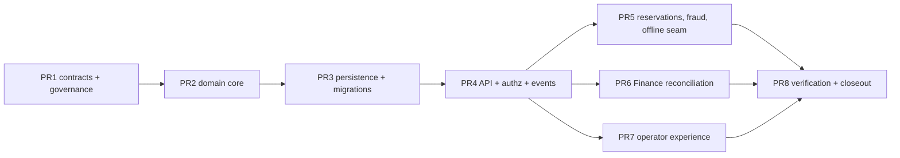

# WS4 Implementation Plan: Stored Value

## 1. Purpose, Authority, and Lifecycle

This document expands `FIRST_SLICE_IMPLEMENTATION_PLAN.md` (PDA-RDM-007) section "WS4 — Stored Value (P4)" into the implementation-control plan for Technical Prototype 4. It defines the capability depth, owners, package boundaries, contract corrections, pull-request sequence, parallel execution lanes, autonomous-agent execution protocol, evidence, and exit gates that will govern WS4 once its entry gate is recorded.

This is a **Draft preparatory plan for a controlled prototype that has not been entered**. Publishing it advances no workstream stage, satisfies no gate, and claims no progress — exactly as PDA-RDM-007 already provides for WS5/WS6 preparatory design. It does not ratify ADR-0013, disposition FDR-003, promote any Draft source, authorize a pilot or production deployment, or establish a contractual service level. If this plan conflicts with the Constitution, a ratified or accepted ADR, or a higher-authority approved specification, the higher-authority source wins and work stops for disposition.

### 1.1 Entry gate and execution authorization

WS4 implementation may begin only when **both** of the following are recorded:

1. WS3 is done, and
2. the M3 standing-audit charter checkpoint records the general P4–P7 entry-clearance disposition against completed P3 evidence (PDA-RDM-007 §7).

Neither condition is met at authoring time. WS3 remains blocked on issue #94 (restricted raw-evidence handling) and issue #82 (retained real-world customer evidence); FDR-012's controlled-prototype exception names only WS3 and the isolated branch `claude/ws3-integration` — **it does not extend to WS4**. No analogous exception exists for WS4. If the Founder later wants WS4 implementation to begin ahead of M3, that requires a new recorded founder decision naming an isolated branch and the gates that continue to bind entry recording, merge to `main`, and progress claims; this plan cannot substitute for that decision.

Work permitted **now**, before entry: maintaining this plan, contract-precision reconciliation that corrects already-registered draft artifacts (only through normal governed PRs), and UI pattern research under §10 that produces no production code claims. Such hygiene PRs are ordinary governance work, not early PR1 execution: they claim no WS4 progress, and if they land, PR1's reconciliation scope becomes *verifying* the §2.2 ledger rather than redoing it, with G5 satisfied by that verification. Work **not** permitted now: creating `domains/stored-value` or persistence packages, freezing schemas, recording WS4 entry, or advancing `PROGRAM_STATUS.md`.

### 1.2 Governing sources

| Concern | Governing source |
|---|---|
| Authority and lifecycle | PDA-FND-002; repository `AGENTS.md` |
| First-slice scope and depth | PDA-RDM-001, PDA-RDM-003, PDA-RDM-004, PDA-RDM-006, PDA-RDM-007, `registry/first-slice.json` |
| Stored-value ownership and semantics | ADR-0013 (**Proposed**), PDA-DOM-025, PDA-DOM-001 |
| Loyalty boundary | ADR-0009 (**Proposed**); non-cash value never silently converts to monetary liability |
| Entity states and invariants | PDA-ARC-013 (`FIRST_SLICE_ENTITY_AND_STATE_MODEL.md`) §Stored Value Entities, §Invariants |
| Modular boundaries | ADR-0002, ADR-0003, PDA-ENGR-012, `registry/architecture-rules.json` |
| Runtime and persistence | ADR-0020, ADR-0027, PDA-ENGR-013 |
| Events and transactions | ADR-0016, PDA-ARC-005, PDA-PLT-008 |
| Permissions and entitlements | PDA-PLT-004, PDA-PLT-005, PDA-PLT-027, permission and endpoint registries |
| Currency and settlement authority | **FDR-003 (Open)** — named PR1 schema-freeze blocker |
| Domain dependency contracts | PDA-DOM-022 §"Stored Value within Commerce" |
| Finance handoff | PDA-DOM-026, `schemas/finance/finance-handoff-v1.schema.json` |
| Privacy and classification | ADR-0014, PDA-DAT-010, PDA-SEC-011 |
| Quality budgets | PDA-RDM-006 — stored-value ledger posting 99.99%, zero unexplained monetary divergence |
| Evidence | PDA-TST-013, `registry/first-slice-tests.json`, PDA-RDM-007 §6 (DoD) |
| Work coordination | PDA-ENGR-014, `WORKTREE_CHANGE_AND_RELEASE_COORDINATION.md`, the GitHub Project |
| Working practice | `ENGINEERING_NOTEBOOK.md` multi-agent independent review discipline |
| Competitive research | PDA-CIR-043 (`STORED_VALUE_COMPETITIVE_CAPABILITY_MATRIX.md`) and PDA-CIR-044 (`STORED_VALUE_WORKFLOW_REFERENCE.md`) — dedicated stored-value competitive research already exists (v0.2.0 correction: v0.1.0 incorrectly claimed no such matrix existed; independent review found it). Plus `ADOPT_IMPROVE_REJECT_REGISTER.md` AIR-001 (operation identity/idempotency), AIR-002 (append-oriented consequential facts), AIR-005 (offline bounds/reconciliation); `COMMERCE_WORKFLOW_REFERENCE.md` return/exchange compensation flow |

ADR-0013 and ADR-0009 are **Proposed**, not Accepted. Under the lifecycle rule they may guide only this named controlled prototype, which explicitly tests them; WS4's exit evidence is intended to become part of the promotion case for ADR-0013. Production implementation may not rely on them until they are Accepted.

## 2. Verified Starting State and Reconciliation Ledger

The baseline below was independently verified against the working tree at authoring time (branch `claude/remote-control-0974e7`, from `main` at `da38611`). Counts are the starting point, not immutable targets; PR1's approved corrections will change them, after which generated registries are the exact source.

### 2.1 Registered surface

| Artifact | Verified state |
|---|---|
| Capabilities | `commerce.stored-value` (full, deps: `commerce.stored-value-ledger`, `security.risk-policies`, offline `AllowanceLimited`); `commerce.stored-value-ledger` (full, deps: `platform.audit`, offline `QueueAndReconcile`); `commerce.store-credit` (full, **namespace-default metadata, no explicit deps**); `commerce.gift-cards` (full); `commerce.gift-receipts` (prototype); all owner Commerce, status Draft |
| Permissions | 8 registered: `commerce.stored-value.{adjust,issue,load,read,reconcile,redeem,reserve,suspend}` |
| Endpoints | 9 operations exist in `openapi/first-slice-v1.yaml` and map 1:1 in `registry/endpoint-permissions.json`: instrument create/read/load/reserve/adjust/suspend, reservation capture/release, reconciliation create |
| Events | 7 registered `commerce.stored-value-*` v1 events (issued, load.posted, redemption.reserved, redemption.captured, entry.reversed, balance.expired, instrument.suspended) |
| Event schemas | **Zero** of the 7 events resolve to a JSON Schema under `schemas/events/` |
| Test matrix | `registry/first-slice-tests.json` scaffolds `commerce.stored-value` and `commerce.stored-value-ledger` with all 13 dimensions required, evidence status Planned, zero evidence; `commerce.store-credit`, `commerce.gift-cards`, `commerce.gift-receipts` carry their own rows |
| Packages | No `packages/domains/stored-value`, no `packages/persistence/stored-value-postgres` — greenfield |
| Architecture rules | No stored-value owner registration in `registry/architecture-rules.json` |

### 2.2 Accepted gaps and contradictions

| Verified fact or gap | Disposition | Closure |
|---|---|---|
| ADR-0013 and ADR-0009 are Proposed, not Accepted | Accepted lifecycle constraint | WS4 runs as the named controlled prototype testing them; exit evidence feeds their promotion case; no production reliance until Accepted |
| FDR-003 (currencies, FX, rounding, settlement) is Open with operating assumptions | Accepted blocking dependency | **PR1 schema freeze may not occur until FDR-003 is dispositioned.** Until then GYD single-currency-per-instrument is an assumption, and every monetary schema field carries explicit currency so a later FDR-003 outcome is additive, not corrective |
| PDA-RDM-007 §WS4 says `domains/stored-value` owns "own migrations" | Accepted contradiction with ADR-0027 | Same correction WS2 recorded: the domain core package owns behavior and ports; `persistence/stored-value-postgres` owns concrete PostgreSQL schema and migrations. PR1 corrects PDA-RDM-007 wording and registers both owners |
| `commerce.store-credit` and `commerce.gift-cards` are separate registered capabilities while PDA-DOM-025 models gift cards and store credit as **instrument types** of one stored-value family | Accepted reconciliation need | This plan maps all four capability IDs onto the single `domains/stored-value` package: `commerce.stored-value-ledger` is the append-only ledger, `commerce.stored-value` the orchestration surface, `commerce.store-credit` and `commerce.gift-cards` instrument-type coverage within them. PR1 records explicit dependency metadata for the two namespace-default entries. Capability IDs are not merged or renamed |
| `commerce.gift-receipts` sits in the registry near stored value | Accepted boundary clarification | Gift receipts are a receipt/return presentation concern owned by the WS3 receipts surface, not a monetary instrument; WS4 claims no gift-receipt evidence. If reconciliation shows otherwise, stop and disposition — do not absorb silently |
| Zero event schemas exist for the 7 registered events | Accepted gap (WS2 precedent) | PR1 supplies canonical JSON Schemas for every event WS4 will emit, or records an explicit non-production deferral per event |
| Ledger facts Release and Adjust have no corresponding registered events; PDA-ARC-013 also lists Activate, Refund, Expire-reversal (Reinstate), Transfer Out/In facts | Accepted gap found during reconciliation | PR1 proposes a reservation-released event, an adjustment-posted event, and an adjustment-denied event (§7's WS4-specific deny path) in the `commerce.stored-value-*` family — exact identifiers are registered under the canonical event grammar only through PR1 propagation across sources, registries, and schemas together — and records an explicit event-or-deferral decision for every remaining ledger fact, including Transfer Out/In per §5's Transfer-or-Merge open decision (not a pre-decided deferral) |
| OpenAPI parameter naming is inconsistent: `{instrumentId}` on reserve, `{id}` elsewhere | Accepted contract-precision defect | PR1 normalizes parameter naming across all stored-value operations |
| No list/history read contracts exist (no instrument list, no ledger-entry history, no reservation read, no reconciliation read) | Accepted gap found during reconciliation (WS2 PR1 precedent) | PR1 adds the minimum tenant-scoped read operations required by reloadable UI workflows, audit review, and reconciliation evidence |
| Exact currency minor-unit and rounding library is an Open Schema Decision (PDA-ARC-013 §Open Schema Decisions) | Accepted blocking design decision | PR1 records the money-representation decision (explicit currency, approved exact decimal/integer semantics, never binary floating point — Constitution Article X.3: "units, currencies, exchange rates, time zones, tax context, precision, and rounding rules must be explicit"), reusing the WS2 Drizzle exact-decimal spike evidence, and appends it to `TECHNOLOGY_LIFECYCLE_AND_LESSONS.md` |
| Offline allowance semantics depend on device trust that WS5 owns | Accepted scope seam | WS4 proves reservation/allowance ledger semantics with an explicit seam: signed device allowances, leases, and sync transport are WS5. WS4's offline evidence is limited to allowance accounting, duplicate-use controls, and the reconciliation queue |

## 3. Mandatory Pre-Implementation Gates

Two distinct gate classes exist and must not be conflated. (v0.1.0 stated all gates block "PR1 opening," which is self-contradictory — G2–G8 are PR1's own deliverables and cannot precede the PR that produces them; independent review caught this and this version corrects it.)

### 3.1 Pre-PR1 gate — blocks opening PR1 at all

- **G1 — Entry authority.** The M3 charter checkpoint disposition (or a founder-recorded WS4-specific controlled-prototype exception naming an isolated branch) exists in writing. This plan cannot create it. No issue, branch, or worktree for PR1 opens before G1 is recorded.

### 3.2 PR1 exit gates — each names its own exact downstream blocker

PR1 exists to produce G2–G8; they do not uniformly block "PR2" — each names exactly one specific downstream blocker below (G2, G4, G5, G6, G7 block PR2 opening; G3 and G8 block PR3 opening — PR3 already depends on PR2, so nothing needs to name PR3 twice). PR1's own closeout requires all seven of G2–G8 recorded regardless of which later PR each one blocks.

- **G2 — FDR-003 disposition before schema freeze.** PR1 may draft schemas, but the freeze that PR2+ builds on requires FDR-003 dispositioned. If the Founder records a bounded interim decision (e.g., GYD-only for the prototype), that decision is cited verbatim in PR1. PR2 does not open until G2 is recorded.
- **G3 — Money representation decision.** The minor-unit/rounding decision from §2.2 is recorded with evidence before any migration is authored (blocks PR3, not PR1's drafting work).
- **G4 — Owner registrations and prototype-stack scope extension.** `domains/stored-value` (core) and `persistence/stored-value-postgres` (PostgreSQL owner) are registered in PDA-ENGR-012 source ownership and regenerate cleanly into `registry/architecture-rules.json` with positive and negative ownership tests. Additionally: ADR-0020 §Decision selects Bun/Hono/oRPC only "for Technical Prototypes 1–3," and ADR-0027 (line 18) "may guide the named controlled prototypes in PDA-RDM-008 and PDA-RDM-009" — WS1 and WS2 by name, not WS4. Neither ADR extends to WS4 by inference. PR1 records an explicit amendment (version bump on both ADRs) naming PDA-RDM-011/WS4 as an additional controlled-prototype scope, carried through a three-lens review (Platform Architecture, Data Platform, Security) recorded at prototype scope — the review depth WS1 PR2 used; WS2 PR5's owner-extension review (ADR-0027 line 22) was recorded as one consolidated review rather than three separate lens rows, so WS4's three-lens requirement follows WS1's precedent specifically, not an identical WS2 PR5 precedent. No WS4 package registers ownership or lands code before this amendment and review are recorded. **PR2 does not open until G4 is recorded** (PR3's later dependency on PR2 makes a separate PR3 blocker redundant — G4 states one blocker, not two).
- **G5 — Contract reconciliation complete.** Every §2.2 contract correction has propagated through source documents, OpenAPI, permission/endpoint/event registries, and schemas together — no partial propagation. This includes the exact capability-dependency arrays PR1 must record: `commerce.store-credit` and `commerce.gift-cards` each add `["commerce.stored-value-ledger", "security.risk-policies"]` as dependencies, mirroring `commerce.stored-value`'s already-declared array, because ADR-0013 and PDA-DOM-025 treat gift cards and store credit as instrument types drawing on the one ledger. `registry/capability-metadata.json` is the governed dependency-metadata overlay `scripts/generate_registries.py` actually reads (confirmed: `commerce.stored-value` and `commerce.stored-value-ledger` already carry their dependency arrays there); `BUSINESS_CAPABILITY_MAP.md` registers the capability identifiers and owners but carries no dependency arrays itself. PR1 adds `commerce.store-credit` and `commerce.gift-cards` entries to `registry/capability-metadata.json` with the array above, or records a disposition if reconciliation against PDA-DOM-025/ADR-0013 disagrees — it does not leave the array unspecified for an implementer to invent. PR2 does not open until G5 is recorded.
- **G6 — Payment and Loyalty boundary restated.** The PR1 contract package records: Payment Engine requests stored-value authorization from Commerce and never owns balances (PDA-DOM-022 prohibited shortcut); Finance never rewrites the ledger; Loyalty value never enters this ledger (ADR-0009 required control: an automated test proves monetary stored value cannot enter the Loyalty ledger and vice versa). PR2 does not open until G6 is recorded.
- **G7 — Fixture baseline.** The Demerara Retail Test Group fixture is extended with stored-value programs, instruments, and two-tenant isolation data. **PR2 does not open until G7 is recorded** (unifying this with G4/G5/G6's blocker so PR2's unit suites have fixture data to assert against from the start, rather than opening against an undefined fixture).
- **G8 — Data classification and tenant-isolation declaration.** Before `bun run db:generate` produces the first stored-value migration (PR3), PR1 records for every planned table and field: owner, tenant/legal-entity scope, classification (ADR-0014/PDA-DAT-010), retention, erasure effect, offline/export/search eligibility, and authoritative-vs-projection status — the same per-table declaration the WS2 plan required (`WS2_CATALOG_AND_INVENTORY_IMPLEMENTATION_PLAN.md` §"Data Classification and Isolation") — plus an explicit controlled-prototype RLS disposition naming the compensating control that substitutes for production RLS while RR-007 stays open, following ADR-0020's Security-row precedent (prototype-scope concurrence with a named forward caveat, not a claim that the caveat is closed). PR3 does not open until G8 is recorded.

No gate here authorizes G1 itself; G1 is the one gate this plan cannot satisfy by writing more of itself.

## 4. Package and Ownership Plan

Per ADR-0002/0003/0020/0027, mirroring the Catalog/Inventory precedent:

| Package | Role | Constraints |
|---|---|---|
| `packages/domains/stored-value` | Commerce-owned stored-value core: aggregates, ledger fact model, state machines, ports, domain services | Runtime-neutral (no Bun globals, no Hono/oRPC types, no database adapter); owns behavior, not concrete schema |
| `packages/persistence/stored-value-postgres` | Concrete PostgreSQL schema, Drizzle migrations, repository adapters | Owner-specific per ADR-0027; append-only ledger tables; no other domain imports its tables or migrations |
| `packages/contracts/api` (extend) | Generated stored-value OpenAPI operation types | Generated from `openapi/first-slice-v1.yaml`; not hand-edited |
| `packages/contracts/platform-api` (extend) | Stored-value oRPC contract surface | `generated.ts`'s `OPENAPI_OPERATION_METADATA` is generated from `openapi/first-slice-v1.yaml` + `registry/endpoint-permissions.json` (not hand-edited); the actual oRPC procedure definitions and zod v4 request/response schemas in `index.ts`/`schemas.ts` are **hand-authored** against that generated metadata, matching the existing pattern for every other domain — v0.4.0 corrected an earlier overstatement that this whole package was generated |
| `packages/contracts/events` (extend) | Stored-value event payload types | Event **names/owners** are generated from `registry/events.json`; the envelope type and per-event payload types are **hand-authored** (mirroring `schemas/events/*.schema.json` by hand, per the existing envelope.ts precedent — no JSON-Schema-to-TypeScript compiler exists in this workstream's scope) |
| `packages/contracts/permissions` (extend) | Stored-value permission constants | Generated from `registry/permissions.json`; not hand-edited |
| `packages/contracts/capabilities` (extend) | Stored-value capability constants | Generated from `registry/capabilities.json`; not hand-edited |
| `apps/server` (extend) | oRPC/HTTP surface mounting the stored-value API | Declares permissions per operation; typed errors |
| `apps/web` (extend) | Operator experience (§10) | Governed UI rules only |

Explicitly **not** created in WS4: any Payment Engine package (`engines/payments` is WS6), any Loyalty package, any Finance posting engine. **Scope of the one seam WS4 does design:** the stored-value authorization-request surface itself (§6's reserve/capture/release operations) is WS4's own contract, callable later by WS6's Payment Engine per ADR-0013's "Payment Engine ... requests stored-value authorization from Commerce" boundary. This is narrower than the full POS tender-orchestration integration: **the broader return-to-original-tender path, and how WS3's sale/return flow and WS6's tender adapter jointly consume this seam, are not designed anywhere in this repository yet** (§13, §15) — WS4 provides the callable surface, not the calling integration.

## 5. Ledger Semantics and Shared Vocabulary

The domain model implements every PDA-DOM-025 (§Core Entities) and PDA-ARC-013 entity **except Transfer or Merge, which is explicitly not yet decided** (see that row below) — divergence elsewhere stops for disposition rather than being silently narrowed. (v0.1.0 named only four of PDA-DOM-025's twelve core entities and asserted a transfer/merge deferral that PDA-DOM-025 does not state — its actual §Initial Scope deferrals are coalition programs, cash-equivalent withdrawals, cross-tenant instruments, and regulated wallets, and ADR-0013 explicitly assigns transfer/merge to Commerce. Independent review caught this; the table below is the correction.)

| PDA-DOM-025 core entity | WS4 disposition |
|---|---|
| Stored Value Program | Implemented — states Draft/Active/Suspended/Closed per PDA-ARC-013 |
| Program Version | Implemented as an immutable version reference on Program; rule-version field on every ledger entry (PDA-DOM-025 §Ledger Model) |
| Stored Value Instrument | Implemented — states Created/Inactive/Active/Suspended/Expired/Closed |
| Customer Balance Account | Implemented as the Party-linked account for registered instruments; anonymous instruments carry no account record (PDA-DOM-025 §Privacy) |
| Stored Value Ledger Entry | Implemented — facts Issue, Activate, Load, Reserve, Release, Redeem, Refund, Reverse, Expire, Reinstate, Adjust. **Transfer Out/Transfer In are conditional on the Transfer-or-Merge open decision below (option a)**; if PR1 instead records the deferral (option b), these two facts are removed from PR2's scope rather than implemented unused |
| Reservation | Implemented — states Active/Captured/Released/Expired/Reconciliation Required |
| Redemption | Implemented as the Reservation-capture path (immediate redemption is a zero-duration reserve+capture) |
| Expiry Schedule | Implemented as policy configuration driving the Expire fact; jurisdiction-specific values are prototype placeholders per §15 |
| Manual Adjustment | Implemented — states Pending/Approved/Denied, governed by the maker/checker state machine in §7 (the Denied state and its deny operation are a WS4 extension beyond WS3's Pending/Approved precedent, per §7) |
| Transfer or Merge | **Open decision, not pre-deferred by this plan, though the evidence leans toward deferral.** PDA-DOM-025 lists it as a core entity and ADR-0013 assigns it to Commerce, so this plan does not have authority to narrow that scope on its own (AGENTS.md/CLAUDE.md §14 Prohibited Behavior: silent contradiction resolution and scope expansion/reduction for convenience are both listed prohibitions). PDA-CIR-043 (`STORED_VALUE_COMPETITIVE_CAPABILITY_MATRIX.md`) independently found transfer "uncommon or constrained" in the market and recommends it stay "deferred unless explicitly authorized and evidenced" — that competitive finding supports option (b) below but does not itself constitute the required disposition. PR1 records one of: (a) a bounded single-tenant, same-program instrument-to-instrument transfer implementation with its own contract/permission/event, or (b) an explicit deferral proposal citing PDA-CIR-043's finding, routed through PDA-RDM-003 §Change Control (doc + `registry/first-slice.json` together, founder approval since it narrows an ADR-0013-assigned capability). WS4 does not silently ship without one of these two dispositions recorded |
| Suspension | Implemented — Instrument state plus a dedicated ledger-adjacent record of reason/actor per PDA-DOM-025 §Security and Fraud Controls |
| Terms and Disclosure Version | Implemented as an internally retained, versioned reference on every instrument/entry, ready to be surfaced once a customer-facing read exists. PDA-DOM-025 §Ledger Model calls for "customer-visible balance, pending value, expiry, and terms," but no customer-facing surface exists in first-slice scope (§13) — WS4 stores and versions the data now and exposes it through PR7's operator read only; true customer visibility remains the same open item §13 already names, not resolved here |

- **Append-only with linked reversal.** Balances derive from entries; posted entries are never mutated or deleted; corrections are linked reversal + replacement entries (Constitution Article X.1: "ledger-like records must use append-only or controlled-reversal patterns"; AGENTS.md/CLAUDE.md §7 names stored-value facts explicitly among those requiring reversal or compensation).
- **Entry completeness.** Every entry records tenant, legal entity, program, instrument/account, currency, value, source transaction, channel, operator, timestamps, idempotency key, rule version, and correlation identifiers (PDA-DOM-025 §Ledger Model).
- **Money.** Explicit currency on every monetary field; exact decimal/integer semantics per the G3 decision; one issued currency per instrument (current FDR-003 operating assumption, revisited at G2).
- **Idempotency.** Issuance, load, reservation, capture, release, and adjustment are idempotent by client-supplied idempotency key; duplicate submission returns the original outcome. Offline-created entries use globally unique client identifiers (PDA-ARC-013 invariant 6).
- **Concurrency.** Reservation and redemption under concurrent access serialize through the persistence adapter such that available balance never goes negative and no double-capture is possible; this is a PR3/PR5 evidence obligation, not an assumption.
- **Identity.** Opaque internal identifiers; human-readable instrument references issued via `platform/numbering`; anonymous instruments minimally identifiable; registered accounts link to Party through a scoped reference with ADR-0014 pseudonymization preserving financial facts.

## 6. Canonical Contract Surface

Target surface after PR1 reconciliation (all tenant-scoped, all declaring permissions):

| Operation | Permission | Notes |
|---|---|---|
| `POST /v1/stored-value-instruments` | `commerce.stored-value.issue` | Idempotent issuance; instrument type gift-card or store-credit |
| `GET /stored-value-instruments` (proposed) | `commerce.stored-value.read` | **New in PR1** — tenant-scoped list |
| `GET /v1/stored-value-instruments/{id}` | `commerce.stored-value.read` | Existing |
| `GET /stored-value-instruments/{id}/entries` (proposed) | `commerce.stored-value.read` | **New in PR1** — ledger history for balance explanation and audit |
| `POST /v1/stored-value-instruments/{id}/load` | `commerce.stored-value.load` | Existing |
| `POST /v1/stored-value-instruments/{id}/reserve` | `commerce.stored-value.reserve` | Existing; parameter naming normalized |
| `GET /stored-value-reservations/{id}` (proposed) | `commerce.stored-value.read` | **New in PR1** |
| `POST /v1/stored-value-reservations/{id}/capture` | `commerce.stored-value.redeem` | Existing |
| `POST /v1/stored-value-reservations/{id}/release` | `commerce.stored-value.reserve` | Existing |
| `POST /v1/stored-value-instruments/{id}/adjust` | `commerce.stored-value.adjust` (maker) | Existing permission becomes the **request** side of a two-permission maker/checker pair per §7 |
| `POST /stored-value-instruments/{id}/adjust/approve` (proposed) | `commerce.stored-value.adjustment-approve` (proposed, checker) | **New in PR1** — no checker permission exists in the current registry; required before adjustment can be implementable per §7 |
| `POST /stored-value-instruments/{id}/adjust/deny` (proposed) | `commerce.stored-value.adjustment-approve` (proposed, checker) | **New in PR1** — the deny-side operation for the `Denied` state; WS3 has no equivalent, this is a WS4-specific extension per §7 |
| `POST /v1/stored-value-instruments/{id}/suspend` | `commerce.stored-value.suspend` | Existing |
| `POST /v1/stored-value-reconciliations` | `commerce.stored-value.reconcile` | Existing |
| `GET /stored-value-reconciliations/{id}` (proposed) | `commerce.stored-value.reconcile` | **New in PR1** |

Rows marked **(proposed)** follow PDA-RDM-007's unprefixed proposal style deliberately: they become governed `/v1` declarations only when PR1 lands them in `openapi/first-slice-v1.yaml` and `registry/endpoint-permissions.json` together.

Events: the 7 registered events plus **three** PR1 candidates — the reservation-released and adjustment-posted events from §2.2, plus a third for the new deny operation above (an adjustment-denied event in the same family, exact identifier subject to PR1 propagation) — each with a canonical JSON Schema under `schemas/events/` conforming to the event envelope, published through the WS2-proven transactional outbox and durable delivery worker. Any new permission or event ID above remains **proposed until PR1 propagates it canonically**; nothing here pre-registers an identifier.

## 7. Authorization, Entitlement, Risk, and Audit Enforcement

- Every operation evaluates permission and entitlement separately (Constitution Article II.4: "Permissions determine who may use an entitled capability. Entitlements determine whether the organization possesses it. These concerns must remain separate."); direct-denial evidence is part of the PR4 matrix, per capability, per tenant.
- **Manual adjustment is maker/checker, modeled directly on WS3's proven pattern.** ADR-0013 requires approval and reason, but neither a request/approve state split nor a checker permission currently exists in the registry for stored value — v0.1.0 asserted "distinct permissions" that were not actually registered; independent review caught this. WS3's implementation on the isolated `claude/ws3-integration` branch (not yet merged to this tree; its POS cash schema-classification document's "Money, Quantity, and Actor Discipline" section, e.g. `commerce.price-override.request`/`.approve`, `commerce.cash-variance.approve`, verified directly against `packages/domains/pos/src/index.ts` on that branch) uses **two distinct permissions per maker/checker pair** plus a `Pending → Approved` request state, and denies same-actor approval with a dedicated `approval_separation` error code enforced in domain code before any irreversible effect — never in UI only. WS4 adopts the two-permission shape identically: `commerce.stored-value.adjust` becomes the maker/request permission; PR1 proposes `commerce.stored-value.adjustment-approve` as the checker permission (§6). **WS4 extends WS3's precedent with an explicit `Denied` state that WS3 itself does not have** — a checker needs to be able to reject a monetary-balance adjustment request outright, not merely never act on it, since a stale unresolved request left in `Pending` is worse for a financial ledger than for a price override. Because this is a WS4-specific extension, not an inherited WS3 behavior, PR1 must also add the deny-side contract WS3 has no equivalent for: a `POST .../adjust/deny` operation (or an explicit outcome field on the existing approve endpoint) under the same checker permission, with its own event and audit evidence — the `Denied` state is not implementable until that operation is named. The checker's actor identity must differ from the maker's, tenant-scoped, enforced by `approval_separation` denial exactly as WS3 does it for both the approve and the new deny path. WS3's own closeout evidence document (also on the isolated `claude/ws3-integration` branch) additionally records a genuine self-caught lesson worth repeating here: an earlier WS3 evidence draft cited maker/checker *audit* coverage in test files that never actually asserted against `platform.audit` — the denial-code check alone was mistaken for audit evidence. WS4's PR5 evidence must independently verify that any claimed audit assertion for the adjustment approval flow actually reads back a `platform_audit_record` row, not merely a denied-response status code.
- **Velocity and fraud controls.** Local hard limits (per-instrument and per-actor issuance/load/redemption velocity) from `security.risk-policies` configuration, enforced at the domain boundary; suspension on breach routes to the operational queue. Broad risk scoring is out of scope; the dependency is the policy contract, not a risk engine.
- **Separation of duties.** PDA-DOM-025 §Security and Fraud Controls requires "separation of administration, adjustment, and reconciliation." This plan maps that requirement onto the registered/proposed permission set rather than inventing a dedicated administration permission — but "administration" names a *group* of three permissions (`commerce.stored-value.issue`, `.load`, `.suspend`), not one, so pairing it against "adjustment" and "reconciliation" as if all were single permissions would understate the required test surface. To make this precisely testable, the fixture defines one **composite Administration role** that holds all three of `issue`/`load`/`suspend` together (the program/instrument lifecycle bundle, per PDA-DOM-025's grouping — not three independent roles). Tests then prove six pairwise denials against the four resulting duty-holders (composite Administration, adjustment-request, adjustment-approval, reconciliation): (Administration, adjustment-request), (Administration, adjustment-approval), (Administration, reconciliation), (adjustment-request, adjustment-approval), (adjustment-request, reconciliation), and (adjustment-approval, reconciliation) — stated individually rather than collapsed into one "adjustment-request-or-approval" pair, because collapsing them would let a role combining reconciliation with only one of the two adjustment permissions pass the fixture undetected. No single fixture role holds both sides of any of the six pairs. If PR1 concludes the composite-Administration model under-separates a real risk (e.g. `issue` and `suspend` should themselves be split), it revises this before schema freeze rather than after; this plan does not assume today's grouping is final, only that it is the tested baseline.
- Every state transition and adjustment lands in `platform.audit` with actor, reason, and correlation; audit rows are part of scenario evidence, verified as real `platform_audit_record` reads per the lesson above, not inferred from a denial status code.

## 8. Offline and Degraded Behavior (WS5 Seam)

WS4 proves the **accounting** side of offline stored value only: allowance-limited authorization (`AllowanceLimited`), pre-reserved value redemption, duplicate-use detection on reconciliation, and the `Reconciliation Required` queue. A stale global balance is never treated as authoritative (PDA-DOM-025 §Offline Operation). Device enrollment, signed allowances, leases, batch transport, and tombstones are WS5; WS4 exposes the seam as an explicit port with a documented contract and records the seam boundary in its exit evidence. Offline claims beyond this are prohibited.

## 9. Finance Reconciliation and Handoff

WS4 completes the stored-value rows of PDA-DOM-026: issuance, redemption, breakage/expiry seam, and liability movement flow into the accountant handoff with batch control totals; stored-value mismatch is an explicit exception state, never silently netted. The reviewer cannot edit a posted stored-value fact through the export. Reconciliation evidence demonstrates: ledger-derived liability balance per legal entity/program/currency, agreement with the handoff export, and one full reversal traced end-to-end into the export. Finance interpretation (breakage recognition, unclaimed property) stays out of scope — Commerce applies operational rules and retains evidence.

## 10. Experience Surface

One governed operator experience PR (PR7): instrument issue/load lookup, balance and ledger history, reservation view, suspension, maker/checker adjustment flow, and the reconciliation exception queue. Rules, in order:

1. Invoke `frontend-architecture` for the pre-implementation plan and `frontend-implementation` before writing any UI code; `ui-pattern-audit` reviews pattern selection; `accessibility-review` performs the formal review.
2. Search platform-owned components first, then shadcn Studio Pro (MCP + CLI), then Mobbin — in that order — before hand-building any block, page, or pattern; route any external intake through `COMPONENT_INTAKE_FAST_PATH.md` / the `component-intake` skill with provenance. MCP availability or paid access never grants approval; promotion gates in `PREFERRED_COMPONENT_CATALOG.md` still apply.
3. Semantic tokens only; no raw palette values (AGENTS.md/CLAUDE.md §11); canonical states, accessibility, and responsive coverage per Constitution Article V (Experience and Simplicity); white-label coverage per Constitution Article VI (Brand and White-Label Architecture); offline coverage per Constitution Article XI.2; performance coverage per §14's PDA-RDM-006 budget evidence. Treat UI-governance violations as review-blocking defects.
4. Pattern research (not code) may run before WS4 entry; it produces catalog candidates and an audit trail, not progress claims.

## 11. Pull Request Sequence and Parallel Lanes

One issue, one branch, one worktree, one PR per independently mergeable change (PDA-ENGR-014). Dependency graph:

| PR | Scope | Key evidence |
|---|---|---|
| PR1 | All §2.2 corrections; event schemas; OpenAPI/read-contract additions; owner registrations; money decision; PDA-RDM-007 §WS4 correction; fixture extension; data-classification declaration | Gates G2–G8 recorded (G3/G8 satisfied as drafted decisions ahead of PR3's actual migration); registries regenerate cleanly; `--check` green |
| PR2 | `domains/stored-value` core: aggregates, ledger facts, state machines, invariants, idempotency, ports | Runtime-neutral unit suites on Bun **and** Node; property tests on balance derivation (balance = fold of entries, never negative available) |
| PR3 | `persistence/stored-value-postgres`: schema, migrations, adapters | Concurrency/serialization evidence (concurrent reserve/capture races), two-tenant isolation, ledger rebuild-from-entries, exact-decimal round-trip, plus the full §11a Operations/Migration/Recovery evidence set |
| PR4 | API surface, permission/entitlement enforcement, audit wiring, outbox event publication | Contract-conformance diff vs OpenAPI/registries; direct-denial matrix; consumer-idempotent delivery via the WS2 worker |
| PR5 | Reservation lifecycle under concurrency, velocity limits, maker/checker adjustment, offline allowance seam, reversal flows | Race-condition suites; double-capture impossibility; velocity breach → suspension; distinct-actor approval proof |
| PR6 | Reconciliation command + reads; Finance handoff stored-value rows; liability reporting | Handoff export with control totals; mismatch exception path; reversal traced into export |
| PR7 | Operator experience per §10 | Canonical states, accessibility target evidence, budgets measured |
| PR8 | Full evidence matrix run, performance/capacity runs (100k-instrument scale assumption), closeout record, technology-ledger entry, ADR-0013 promotion-case evidence | Scenario 7 end-to-end incl. reversal + reconciliation; every §13 ADR-0013 validation-slice row has a recorded outcome — closed against its bound PR/evidence cell, closed via a named change-control deferral, or (return-to-original-tender only) explicitly carried forward as an honest unresolved cross-workstream gap not owned by WS4, per §13's exact wording — never silently dropped; DoD (PDA-RDM-007 §6) satisfied per item |

**Parallelism.** PR1–PR4 are strictly sequential (each consumes the previous baseline). After PR4 merges, PR5, PR6, and PR7 may run as **three parallel lanes in separate worktrees** — they touch disjoint surfaces (domain/risk semantics vs. Finance export vs. web UI) and their overlap (shared contracts package) is frozen at PR4. Record the overlap declaration per `WORKTREE_CHANGE_AND_RELEASE_COORDINATION.md` before the lanes start. PR8 is a barrier. **Within any single PR, only read-only/review agents may run concurrently** (independent-review and Codex passes per §12); PDA-ENGR-014's One-to-One Rule prohibits assigning two active writing agents to the same worktree or branch, so a PR's implementation work is single-threaded by one agent in one worktree — "parallelize freely" in v0.1.0 contradicted that rule and is corrected here. If a PR's scope is genuinely large enough to want concurrent writers, it is split into independently mergeable sub-issues, each with its own branch/worktree/PR, not run as parallel writers inside one PR.

## 11a. Operations, Migration, and Recovery (PR3 obligation)

v0.1.0 left this uncovered — a gap independent review flagged as material for a Party-linked monetary ledger. Following the WS2 plan's precedent (`WS2_CATALOG_AND_INVENTORY_IMPLEMENTATION_PLAN.md` — migration/operations evidence section), PR3 must additionally evidence:

- **Migration lifecycle.** Clean install (empty database, apply all migrations, zero errors); repeat-without-drift (re-run against an already-migrated database, no schema diff); representative upgrade (apply against a populated prototype dataset); failed-stream recovery (an interrupted migration leaves no partial state, per the WS1/WS2 `persistence.integration.test.ts` pattern); deterministic migration ordering with a distinct `stored_value_migrations` table preserving `single_migration_owner` (ADR-0027).
- **Rollback/forward-fix policy.** Named explicitly: whether a failed WS4 migration is rolled back or forward-fixed, and how a partially-applied ledger table is detected before it accepts writes.
- **Shutdown behavior.** If PR3 introduces no new long-lived process (expected — WS4 reuses the WS2 outbox/worker), state that explicitly and point to the unchanged WS2 shutdown mechanism, mirroring how the WS3 plan disposed of this item rather than leaving it unaddressed.
- **Reconciliation/rebuild runbook.** A documented procedure for rebuilding a stored-value balance from its append-only entries (the same rebuild-from-entries property PR3 already evidences) and for resolving a `Reconciliation Required` reservation, added to the operational runbook set alongside `IMPORT_AND_NUMBERING_RECOVERY_RUNBOOK.md`'s pattern.
- **Backup/restore coverage.** Stored-value tables are named explicitly in the point-in-time restore scope this repository already exercises for WS1/WS2 data (`BACKUP_RESTORE_AND_DISASTER_RECOVERY.md`); PR3 records that stored-value tables are included, not silently assumed covered.
- **Budget measurement protocol.** The PDA-RDM-006 99.99%/zero-unexplained-monetary-divergence budget (§14) is measured, not asserted, against a stated protocol recorded in PR3/PR8: the measurement environment (which suite run, which environment — CI Docker stack vs. local), the denominator (ledger entries posted vs. attempted, per suite run), sample size, warm-vs-cold state, how a suite failure or timeout is counted (as a failure, not excluded), and the exact commit/run this measurement is attached to — the same specificity the WS2 plan's budget evidence required, so "99.99%" cannot mean a different, unstated thing on different runs.

## 12. Autonomous Agent Execution Protocol (Overnight Sessions)

This section governs how AI agents execute the sequence in §11 once G1 authorizes entry. It encodes the repository's recorded working practice; it grants no authority.

**Per-PR loop (every lane, no exceptions):**

1. **Claim.** One GitHub issue per PR (created via the project's issue forms/labels/milestones), one branch, one worktree.
2. **Implement** strictly within the PR's §11 scope. On discovering any boundary ambiguity, authority conflict, or missing decision: stop the lane, record the gap in the issue, do not invent (AGENTS.md/CLAUDE.md §15: "When uncertain, stop and record the missing decision or evidence rather than inventing it").
3. **Self-verify.** `bun run gates` — the full set, not a subset. Budgets measured, never asserted. **A gate that fails locally blocks progression to push.** The ~11 gates `bun run gates` itself reports as CI-only (live Docker stack, migration freshness, health probes — see `bun run gates -- --list`) are not failures to chase locally; they are declared out-of-local-reach and instead **block merge**, resolved when CI runs them post-push. Step 7's push therefore follows a locally-green `bun run gates`, not a state where every gate including CI-only ones has already passed — that would be impossible to reach locally and was an unintended deadlock in v0.5.0 and earlier.
4. **Independent review.** A fresh-context reviewer agent (no shared conversation state with the implementer) reproduces the evidence from the diff alone and reviews adversarially per `ENGINEERING_NOTEBOOK.md`. Findings are dispositioned in writing.
5. **Codex second review.** Run the Codex reviewer (codex plugin; read-only sandbox) against the branch. Codex findings are verified before acting — its hit rate is high but individual claims are checked against the code, then fixed or dispositioned with rationale.
6. **Loop until dry.** Repeat 3–5 until two consecutive review rounds produce zero new accepted findings.
7. **Push and PR.** Open the PR with the governance template; `scripts/validate_pr_governance.py` passes; CI fully green (including the live-stack gates local runs cannot execute).
8. **Codex bot.** After every push, check the Codex bot review; verify each finding, act, reply to and resolve every thread.
9. **Hold for merge.** WS4 PRs are **never merged autonomously.** Merge requires recorded exact-head independent concurrence plus explicit founder/user authorization — the WS2 F-A-001 deviation (merge without pre-merge concurrence) is the named failure this step exists to prevent. An overnight session ends with PRs green, reviewed, and held, not merged.

**Session rules.** Lanes run in parallel only where §11 permits. Every session leaves a written trail: issues updated, evidence attached, deviations recorded. `PROGRAM_STATUS.md` is updated only from merged evidence, never from in-flight work. If any gate, review, or CI state cannot be verified, the honest state is recorded and the lane stops — a stopped lane overnight is success; an invented green is the defined catastrophic failure.

## 13. Fixtures and Scenarios

All behavioral evidence runs against the **Demerara Retail Test Group** fixture (two-tenant, per WS1/WS2 precedent), extended in PR1 with: two stored-value programs (gift card, store credit), instruments in every lifecycle state, a registered customer Party linkage, an anonymous instrument, and cross-tenant negative fixtures.

Exit scenario: PDA-RDM-003 acceptance scenario 7 — *issue, reserve, redeem, reverse, and reconcile stored value* — demonstrated end-to-end including reconciliation into the Finance handoff. Scenario 7 alone does not cover every ADR-0013 validation-slice behavior; v0.1.0 listed the full slice in prose without binding each item to a PR or evidence cell, so items could pass review by omission. The table below is the binding correction — every ADR-0013 validation item maps to a specific PR and evidence cell, or is named as a recorded deferral, before PR8 may declare exit:

| ADR-0013 validation-slice item | Bound to | Evidence cell |
|---|---|---|
| Sale issuance | PR2 (issuance aggregate) + PR4 (API) | `happy_path` on `commerce.stored-value` |
| Redemption | PR2 + PR4 | `happy_path` on `commerce.stored-value-ledger` |
| Partial redemption (reserve/capture below balance) | PR5 (reservation lifecycle) | `concurrency_and_conflict` + a named partial-capture assertion |
| Return-to-original-tender | **Not WS4 exit evidence, and not yet designed anywhere in this repository.** §4 names no WS3/WS6 tender-seam contract, operation, owner, or closure evidence — only a generic future composition sentence. This plan does not manufacture that contract, does not claim one exists, and does not have authority to create a WS3/WS6-owned obligation from a WS4 document | No evidence cell exists. Closure requires a WS3- or WS6-owned plan (or a future joint one) to first name the seam contract; until then this validation item is honestly incomplete, not tracked, blocked, or deferred by any existing record |
| Return-to-store-credit | PR2 + PR4 | `happy_path` on `commerce.store-credit` |
| Offline reservation | PR5, seam-scoped per §8 | `offline_and_degraded` on `commerce.stored-value` |
| Expiry policy | PR2 (Expire fact) + PR5 (velocity/policy hooks) | `validation_and_denial` on `commerce.stored-value-ledger` |
| Reconciliation | PR6 | `recovery_replay_and_reconciliation` on `commerce.stored-value-ledger` |
| Reversal | PR2 + PR8 (traced end-to-end into the Finance export) | `recovery_replay_and_reconciliation` on `commerce.stored-value` |
| Financial posting handoff | PR6 | Finance handoff export evidence per §9 |
| Customer-visible balance/pending-value/expiry/terms | **Not closeable by PR7.** ADR-0013 requires this control as *customer*-visible; no storefront/portal surface exists in first-slice scope to provide it, and PR7's operator-facing view is not evidence for it — the two prior versions' claim that operator evidence satisfies this row was itself the defect independent review caught | PR7 evidence names this row explicitly unclosed. Closure requires either a real customer-visible surface (out of first-slice scope today) or a PDA-RDM-003 §Change Control deferral naming ADR-0013's customer-visibility requirement as narrowed for the first slice — WS4 does not self-authorize that narrowing |

## 14. Evidence Matrix and Exit Gate

Exit requires, with no readiness claim beyond evidence:

1. Every required dimension for `commerce.stored-value`, `commerce.stored-value-ledger`, `commerce.store-credit`, and `commerce.gift-cards` in the generated matrix carries recorded evidence (exact executable-cell count fixed at the PR1 baseline reconciliation).
2. PDA-RDM-006 budgets measured and reported per the §11a budget measurement protocol: **99.99% ledger posting correctness with zero unexplained monetary divergence** across the concurrency, replay, and reconciliation suites, at the 100,000-instrument scale assumption; variances dispositioned, never waved through.
3. The full DoD of PDA-RDM-007 §6, item by item, including Bun+Node portability, contract-conformance diff, technology-ledger entry, vision conformance with AI disabled, and delete discipline.
4. A closeout record naming what WS4 proved for the ADR-0013/ADR-0009 promotion case and what remains open (FDR-003 final disposition, production RLS topology per RR-007, WS5 device trust, WS6 tender integration, jurisdiction-specific expiry/breakage evidence).

## 15. Open Risks

- **FDR-003 timing** — if undispositioned when G1 clears, PR1 stalls at schema freeze; the mitigation is a bounded founder interim decision, recorded, not assumed.
- **ADR-0013/0009 remain Proposed** — a rejection or material amendment during WS4 stops affected lanes for disposition.
- **Concurrency evidence at budget** — 99.99%/zero-divergence is the platform's strictest bar; if the PR3/PR5 suites cannot demonstrate it, the honest outcome is a recorded variance and a design revisit, not a softened claim.
- **Jurisdictional expiry/breakage** — Guyana-specific consumer-protection and unclaimed-property treatment has no qualified-counsel evidence (issue #84 family); WS4 implements policy hooks with prototype values and records the legal gate as external.
- **Cross-workstream integration debt** — the device-trust (WS5) offline seam is designed as an explicit port (§8) but unexercised end-to-end until WS5 lands. The POS return-to-original-tender path (WS3/WS6) is **not yet designed anywhere** (§13) — no contract, owner, or closure record exists for it in this or any other plan; that gap is a real open item this plan surfaces, not one it resolves.

## 16. Change Log

- 2026-07-21 — v0.6.1 PR #185's automatic GitHub Codex bot review (P2) found that the six-pair separation-of-duties fix from v0.5.0/v0.6.0 had collapsed the final pair into one "adjustment-request-or-approval, reconciliation" case — a role holding reconciliation plus only one of the two adjustment permissions could pass the fixture's five-denial matrix undetected. Corrected to state both `(adjustment-request, reconciliation)` and `(adjustment-approval, reconciliation)` individually, restoring the full six-pair coverage the composite-Administration model requires.
- 2026-07-21 — v0.6.0 fifth Codex verification pass (final planned convergence check against v0.5.0, instructed not to manufacture findings) reported 0 P1, 3 P2, 1 P3, confirming the five targeted v0.5.0 edits introduced no further contradiction and finding only issues in sections not yet closely scrutinized. Corrected: (1) the separation-of-duties model treated "administration" as one permission when it is a three-permission group, understating the required test surface — now defines an explicit composite Administration fixture role and states the five resulting pairwise denials precisely; (2) G5 cited `BUSINESS_CAPABILITY_MAP.md` as the dependency-metadata authority, but verified directly against `scripts/generate_registries.py` that `registry/capability-metadata.json` is the actual overlay the generator reads (and where `commerce.stored-value`'s existing dependency array already lives) — corrected to cite the real source; (3) §12 step 3 required "no skipped gate" before push while `bun run gates` itself declares ~11 gates CI-only and unreachable locally, an unintended deadlock — corrected to distinguish locally-failing gates (block push) from CI-only gates (block merge, resolved post-push); (4) five "Constitution §N" citations throughout the document used CLAUDE.md's own section numbers, not the Constitution's actual Article numbering — verified against `CONSTITUTION.md` and corrected to the real articles (Article X.3 for money/precision, Article X.1 for reversal/append-only, Article II.4 for permission/entitlement separation, Articles V/VI for UI/white-label, Article VIII is AI governance not UI) or re-attributed to AGENTS.md/CLAUDE.md where that was the actual source.
- 2026-07-21 — v0.5.0 fourth Codex verification pass (convergence check against v0.4.0, explicitly instructed not to manufacture findings to fill a quota) reported 0 P1, 4 P2, 0 P3 — down from 7 P2/1 P3 the prior round, confirming convergence. Corrected: (1) the separation-of-duties test list covered only 3 of the 6 pairwise combinations across the four underlying permissions (administration, adjustment-request, adjustment-approval, reconciliation) — now states all six explicitly; (2) §4's contract-package table overstated what `platform-api` and `events` generate — verified directly against `scripts/generate_contracts.py`, `packages/contracts/platform-api/src/index.ts`, and `packages/contracts/events/src/envelope.ts`, and corrected to describe the actual generated-metadata-plus-hand-authored-schema split every other domain already follows; (3) §4 still claimed the POS tender integration "is designed as a contract seam" while §13/§15 said the opposite — narrowed to distinguish the one seam WS4 actually designs (its own authorization-request surface) from the WS3/WS6 return-to-tender integration, which remains genuinely undesigned; (4) §5's Terms and Disclosure Version row still claimed a customer-visible read that §13 had already corrected to not exist — changed to an internally retained, versioned reference pending a real customer surface. A fifth self-review before this commit also caught that PR8's exit criterion required every §13 row "closed... or named as a deferral," which the honestly-unresolved return-to-tender row is neither — corrected to a three-way outcome (closed / deferred / explicitly carried forward as an unresolved gap not owned by WS4).
- 2026-07-21 — v0.4.0 third Codex verification pass against v0.3.0 (fresh adversarial read, no prior-round assumptions) reported 0 P1, 7 P2, 1 P3 — all real, mostly precision gaps the v0.2.0/v0.3.0 fixes themselves introduced or exposed. Corrected: (1) the new deny operation had no event of its own — added a third PR1 event candidate and updated both event-count references; (2) removing the invented administration permission left PDA-DOM-025's required administration/adjustment/reconciliation separation unmapped — now explicitly mapped onto the issue/load/suspend, adjust/adjustment-approve, and reconcile permission groups; (3) G4 stated two redundant blockers (PR2 and PR3, when PR3 already depends on PR2) and G7 didn't actually block PR2 opening despite §3.2's taxonomy claiming it did — both normalized to one stated blocker each, and the §3.2 summary corrected to match; (4) §5's entity table claimed to implement "every" PDA-DOM-025 entity while the Transfer/Merge row said the opposite — the ledger-entry row and intro now explicitly carve out Transfer Out/In as conditional on the not-yet-made decision; (5) §4 named a `packages/contracts` package that doesn't exist — replaced with the five actual generated contract sub-packages (api, platform-api, events, permissions, capabilities); (6) the return-to-original-tender row claimed to be "tracked as an open cross-workstream item" with no actual tracking record, and §15 separately called the same seam "designed" — both corrected to state plainly that no contract, owner, or tracking exists anywhere yet, rather than implying a resolution mechanism that isn't real; (7) the customer-visible-terms row let PR7's operator-facing evidence close an ADR-0013 requirement that is explicitly customer-facing — corrected to state the row is not closeable by PR7 and requires either a real customer surface or a named change-control deferral; (8) G4's "same three-lens review that gated WS1 PR2 and WS2 PR5" overstated the WS2 PR5 precedent, which ADR-0027 records as one consolidated review, not three lens rows — corrected to cite WS1 PR2 as the three-lens precedent WS4 follows.
- 2026-07-21 — v0.3.0 second Codex verification pass against v0.2.0 (same review capability, re-checked directly against WS3's actual source at `packages/domains/pos/src/index.ts` on the isolated branch, not just its docs) reported 8 of 9 prior findings CLOSED, 1 PARTIALLY CLOSED, and 3 new P2 findings — 0 P1 survived. Corrected: (1) removed a self-contradictory "administration is a distinct permission" claim (no such permission exists or is proposed); (2) the plan had misattributed a `Denied` state to WS3, which only has Pending/Approved — now labeled honestly as a WS4-specific extension with its own new deny-side contract row (§6), since a stale unresolved adjustment request is a worse failure mode for a monetary ledger than for a price override; (3) discovered and cited two stored-value-specific competitive-research documents (PDA-CIR-043, PDA-CIR-044) that v0.1.0/v0.2.0 incorrectly claimed did not exist — a real research-completeness gap in the original authoring pass, not merely a citation-format issue; (4) reconciled the Transfer-or-Merge open decision (§5) against PDA-CIR-043's actual competitive finding that transfer should stay deferred absent explicit authorization, without letting that finding substitute for the required disposition; (5) fixed a gate-taxonomy inconsistency where the §3.2 heading claimed all of G2–G8 block "PR2" while G3/G8 individually state they block PR3 — each gate's specific blocker now stated once, consistently; (6) the PR1 evidence row in §11 required only G2–G7, silently dropping G8 — corrected to G2–G8; (7) two rows in the §13 ADR-0013 validation-slice binding table were missing their third (evidence-cell) column and one asserted an obligation on a §4 seam contract that names no actual contract, owner, or closure evidence — both rows corrected to either a real evidence-cell binding or an honestly named unresolved cross-workstream gap.
- 2026-07-21 — v0.2.0 independent Codex review of v0.1.0 returned 3 P1 and 6 P2 findings, all accepted at submitted severity (repository's `codex-plugin-cc`/WSL-fallback review capability, read-only sandbox, cross-checked against ADR-0020/0027, PDA-DOM-025, PDA-ENGR-014, and the WS2/WS3 precedent docs before disposition). Corrected: (1) ADR-0020/0027 do not extend to WS4 by inference — G4 now requires an explicit scope-extension amendment with three-lens review before any package registers, mirroring the WS1 PR2/WS2 PR5 precedent; (2) §5 now enumerates all twelve PDA-DOM-025 core entities and removes a fabricated transfer/merge deferral — Transfer or Merge is recorded as an open decision requiring its own disposition, not a fact this plan could invent; (3) the maker/checker adjustment design cited a "recorded WS3 review lesson" with no actual source — replaced with WS3's real, verified two-permission request/approve pattern (`commerce.price-override.request`/`.approve` et al.) and the real WS3 self-caught lesson about audit-evidence verification, found by reading WS3's closeout-evidence document in the isolated `claude/ws3-integration` worktree (not yet merged to this tree); (4) gates G2–G8 restructured into a pre-PR1 gate (G1) versus PR1-exit gates (G2–G8, since PR1 is the PR that produces them — the prior structure was circular); (5) exact capability-dependency arrays specified for `commerce.store-credit`/`commerce.gift-cards` instead of left for an implementer to invent; (6) "parallelize internal subtasks freely" within one PR corrected to read-only/review-only concurrency, per PDA-ENGR-014's One-to-One Rule; (7) the ADR-0013 validation slice is now bound row-by-row to a PR and evidence cell (or a named cross-workstream obligation) instead of asserted in prose disconnected from PR8's actual exit criterion; (8) added G8, a pre-migration data-classification/tenant-isolation declaration matching the WS2 plan standard; (9) added §11a Operations, Migration, and Recovery plus an explicit budget-measurement protocol, both absent from v0.1.0.
- 2026-07-21 — v0.1.0 initial preparatory Draft: reconciliation ledger, gates, package plan, contract surface, PR sequence with parallel lanes, autonomous execution protocol. Authored before WS4 entry; advances no gate and records no progress. (Superseded by the v0.2.0 corrections above — retained here as history per repository practice of not silently rewriting prior versions out of the change log.)
